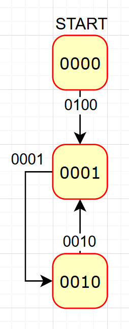

Remember the FPGA part of the pinout of the GPIO header on the main board:

| FUNCTION   | PIN | PIN | FUNCTION |
| ---------- | --- | --- | -------- |
| FPGA_CLK | 1   | 2   | FPGA_RST |
| FPGA_I0    | 3   | 4   | FPGA_O0  |
| FPGA_I1    | 5   | 6   | FPGA_O1  |
| FPGA_I2    | 7   | 8   | FPGA_O2  |
| FPGA_I3    | 9   | 10  | FPGA_O3  |

FPGA_RST is floating and it resets the FPGA when pulled high (and a CLK rising edge occurs).

We have this FPGA programmed with a finite state machine (FSM), it was outsourced, we lost the documentation and we think the contractor installed a backdoor in order to get the FLAG.

The states of the FSM are repsented by the four output (FPGA_O0-3) that are connected to the four led on the PCB (NOTE: the leds are inverted, so when the output is high the led is off).
The state of the FSM changes based on the inputs (FPGA_I0-3) every time the FPGA_CLK pin goes from low to high, only if there is a valid input for the current state.

We were only able to remember the following part of the diagram:

Which means that the FSM has the states 0000, 0001, 0010 (it could have more) and the transitions are:

- 0000 -> 0001 if INPUT is 0100
- 0001 -> 0010 if INPUT is 0001
- 0010 -> 0000 if INPUT is 0010

You have to pass exactly once through each state before reaching 1111 or else the FSM will disable itself once you visit a previous visited state. The FSM will be disabled even if you reach the state 1111 without visiting all the states.  
`Disabled` means that the FSM will not change its state anymore and the FLAG will not be displayed.

Once the FSM reaches the state 1111 (all led off), that shouldn't be possible, it starts a second FSM that outputs the FLAG (this second FSM may take up to 5 clock cycles to display the first nibble).

This second FSM set the output to the nibbles of the FLAG, one nibble at a time, and it changes the output every time the FPGA_CLK pin goes from low to high.

Example: "ECSC{" -> "0100 0101 0100 0011 0101 0011 0100 0011 0111 1011"
