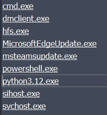
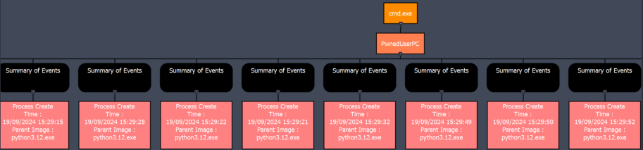
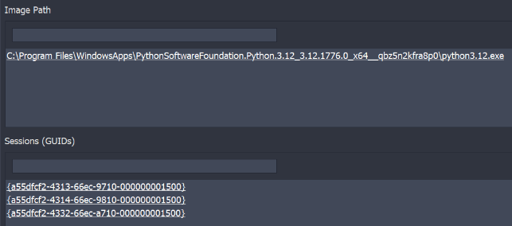
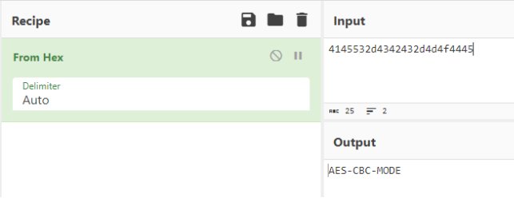
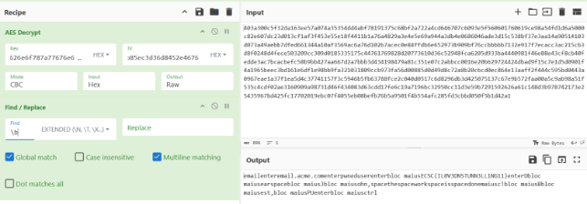
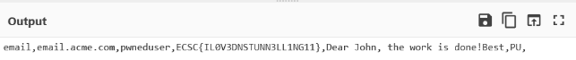

# ECSC 2024 - Jeopardy

## [misc] Beaconing (35 solves)

ACME Company has been alerted that a threat actor is selling the credentials of one of its users (<pwned_user@acme.org>) on a dark web forum. To identify the affected service and prevent further compromise, they need to determine which credential was leaked and how it was exfiltrated.  

Unfortunately, the user’s workstation has been formatted, leaving only Sysmon logs collected by the SIEM for analysis. Can you help identify the stolen credential?

Author: Luca Massarelli <@ACN>, Bruno Taricco <@ACN>, Lorenzo Zarfati <@ACN>

## Overview

You have been provided with a Sysmon log for analysis.

## Solution

You have been provided with a Sysmon log for analysis using tools such as Sysmon View ((<https://github.com/nshalabi/SysmonTools>). Upon loading the raw XML log into Sysmon View, you observe several processes running:

Upon examining the process names, most are standard Windows processes. Focus on the following three processes, as they are commonly used to launch commands or scripts:

- **cmd.exe**
- **powershell.exe**
- **python3.12.exe**

Notably, **cmd.exe** has been executed multiple times, but each instance has **python3.12.exe** as its parent process:

Therefore, it would be worth to examine the executed Python processes. In this instance, we observe three distinct Python processes (sessions) running:

By looking at the name of the scripts executed by the three processes, we can see that their names are:

1. **n01se.py**
1. **main.py**
1. **no!s3.py**

The previous names indicate that the second script is probably relevant one. Examining the events associated with this script, we observe that it first creates a file with a seemingly random name and stores this name in a registry variable. Subsequently, it initiates DNS queries to resolve domains consistently under the TLD “example.com” but with varying subdomains. The volume of network activities of this process could suggest suspicious network activities that could be used for exfiltration.

This hypothesis is further supported by an event where a PowerShell command is invoked by the Python script to change the machine’s DNS resolver:

The latter can be easily identified by examining processes with a parent PID of 13892.

To validate the previous hypothesis, we can start by extracting the list of DNS queries made by this Python process, as shown in the table below.

|**#**|**Request Name**|
| :- | :- |
|1|4145532d4342432d4d4f4445.alg.8BD45a6fed311339f9e9353e1f1f9f14e1b6A3F67.example.com|
|**2**|626e6f787a77676e6b767970706b7474.key.8BD45a6fed311339f9e9353e1f1f9f14e1b6A3F67.example.com|
|**3**|2a6ef5e2fc054b85ec3d36d8452e4676.iv.8BD45a6fed311339f9e9353e1f1f9f14e1b6A3F67.example.com|
|**4**|403a300c5f32da163ee57a074a35354d.c.8BD45a6fed311339f9e9353e1f1f9f14e1b6A3F67.example.com|
|**5**|d4abf78191375c68bf2a722a4cd64670.c.8BD45a6fed311339f9e9353e1f1f9f14e1b6A3F67.example.com|
|**6**|7c6093e5f560601760619ce98a54fd1d.c.8BD45a6fed311339f9e9353e1f1f9f14e1b6A3F67.example.com|
|**7**|6a5000c82e607dc23d013cf1af3f453e.c.8BD45a6fed311339f9e9353e1f1f9f14e1b6A3F67.example.com|
|**8**|55e18f4411b1a76a4829a3e4e5e69a94.c.8BD45a6fed311339f9e9353e1f1f9f14e1b6A3F67.example.com|
|**9**|4a3db4e0686046ade3d15c538bf37e3a.c.8BD45a6fed311339f9e9353e1f1f9f14e1b6A3F67.example.com|
|**10**|a14a90514103d073a49aebb7dfed6613.c.8BD45a6fed311339f9e9353e1f1f9f14e1b6A3F67.example.com|
|**11**|44a10af3569ac6a76d102b7acec0e84f.c.8BD45a6fed311339f9e9353e1f1f9f14e1b6A3F67.example.com|
|**12**|fdb6e652973b909bf76ccbbbbb7132e9.c.8BD45a6fed311339f9e9353e1f1f9f14e1b6A3F67.example.com|
|**13**|17f7ecacc3ac215cb3d8f0248d4fece5.c.8BD45a6fed311339f9e9353e1f1f9f14e1b6A3F67.example.com|
|**14**|03209cc309d0185335175c4476176982.c.8BD45a6fed311339f9e9353e1f1f9f14e1b6A3F67.example.com|
|**15**|8d20773610d36c52948fca6205d933ba.c.8BD45a6fed311339f9e9353e1f1f9f14e1b6A3F67.example.com|
|**16**|4440981f46e88e43cf8cb40fedde3ac7.c.8BD45a6fed311339f9e9353e1f1f9f14e1b6A3F67.example.com|
|**17**|bcacbefc58b9bb427aa667d2a7bbb3d4.c.8BD45a6fed311339f9e9353e1f1f9f14e1b6A3F67.example.com|
|**18**|34198479a81c351e07c2abbcc0016e20.c.8BD45a6fed311339f9e9353e1f1f9f14e1b6A3F67.example.com|
|**19**|b629724424dbad9f15c7e1d5d0901f4a.c.8BD45a6fed311339f9e9353e1f1f9f14e1b6A3F67.example.com|
|**20**|1965beec3bd161e6df1e98bb9fa32103.c.8BD45a6fed311339f9e9353e1f1f9f14e1b6A3F67.example.com|
|**21**|1809ccb973fa56d00885d0d49d8c72a8.c.8BD45a6fed311339f9e9353e1f1f9f14e1b6A3F67.example.com|
|**22**|b20cbcd0ec864e13aaff2f444c595bd0.c.8BD45a6fed311339f9e9353e1f1f9f14e1b6A3F67.example.com|
|**23**|443a0967eae1a37f1ea5d4c37741157f.c.8BD45a6fed311339f9e9353e1f1f9f14e1b6A3F67.example.com|
|**24**|3c5946b5fb63788fce2c040d0517c6d8.c.8BD45a6fed311339f9e9353e1f1f9f14e1b6A3F67.example.com|
|**25**|296db3d425075137c67e9b572faa00a5.c.8BD45a6fed311339f9e9353e1f1f9f14e1b6A3F67.example.com|
|**26**|c9ab98a51f535c4cdf02ae3160909a98.c.8BD45a6fed311339f9e9353e1f1f9f14e1b6A3F67.example.com|
|**27**|731d46f434083d63cdd17fe6c19a7196.c.8BD45a6fed311339f9e9353e1f1f9f14e1b6A3F67.example.com|
|**28**|bc32950cc11d3e59b7291592626a61c1.c.8BD45a6fed311339f9e9353e1f1f9f14e1b6A3F67.example.com|
|**29**|48d3b978742173e25435967bd425fc17.c.8BD45a6fed311339f9e9353e1f1f9f14e1b6A3F67.example.com|
|**30**|702019ebc07f4055eb08befb76b5a950.c.8BD45a6fed311339f9e9353e1f1f9f14e1b6A3F67.example.com|
|**31**|1f4b554afc285fd3cbbd050f5b1d42a1.c.8BD45a6fed311339f9e9353e1f1f9f14e1b6A3F67.example.com|

Examining each query, we notice that the 3rd level domains does not change, while the 4th level domains vary in the first three queries and then consistently appears as “c.” The 5th level domain, however, changes continuously. This pattern could be a sign of exfiltration activity using DNS tunneling.

Looking at the sequence of 4th level domains namely “alg,” “key,” “iv,” and “c” we can infer that we are dealing with encrypted data where, “alg” could represent the algorithm, “c” the ciphertext, and “key” and “iv” are self-explanatory. Decoding the 5th level domain of the first request yields the following:

The decoded text suggests that the subsequent requests contain the KEY, the IV, and an AES-CBC encrypted text with exfiltrated data in the 5th level domain. We can attempt to decrypt this using CyberChef, resulting in:

By examining the output and removing words that suggest the use of special characters like space and shift, we can observe the possible actions taken by the user to access their email account.

Specifically, we notice the presence of the URL ‘email.acme.com’, a potential username, and subsequently a possible password that resembles the flag.
