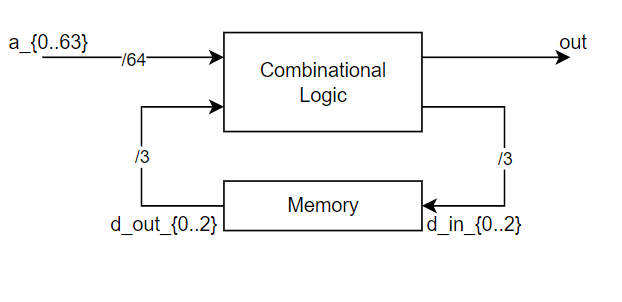

# ECSC 2024 - Jeopardy

## [rev] ~& (11 solves)

It doesn't get more low level than this...

Author: Lorenzo Catoni <@lorenzcat>

## Overview

The challenge presents a verilog module that implements a synchronous circuit, and a python script that simulates the circuit via a testbench. The python script expects the user to provide a flag and it splits it in 64 bits blocks and feeds the blocks to the circuit, each in a different clock cicle, then it checks the output of the circuit to see if the flag is correct.

The circuit is implemented only with `and` and `not` gates:

```verilog
module circuit(clk, reset, a_0, a_1, a_2, a_3, a_4, a_5, a_6, a_7, a_8, a_9, a_10, a_11, a_12, a_13, a_14, a_15, a_16, a_17, a_18
, a_19, a_20, a_21, a_22, a_23, a_24, a_25, a_26, a_27, a_28, a_29, a_30, a_31, a_32, a_33, a_34, a_35, a_36, a_37, a_38, a_39
, a_40, a_41, a_42, a_43, a_44, a_45, a_46, a_47, a_48, a_49, a_50, a_51, a_52, a_53, a_54, a_55, a_56, a_57, a_58, a_59, a_60
, a_61, a_62, a_63, out);
  wire _00000_;
  ...
  wire reset;
  assign _09962_ = ~q_out_1;
  assign _10073_ = ~q_out_0;
  assign _10184_ = ~q_out_2;
  assign _10295_ = ~a_48;
  ...
  assign d_in_2 = _03259_ & _03365_;
  d_flip_flop_array d_flip_flop_array_inst (
    .clk(clk),
    .d_in_0(d_in_0),
    .d_in_1(d_in_1),
    .d_in_2(d_in_2),
    .q_out_0(q_out_0),
    .q_out_1(q_out_1),
    .q_out_2(q_out_2),
    .reset(reset)
  );
endmodule
```

The circuit has 64 inputs plus a clock and a reset signal, and a single output wire. The d_flip_flop_array is a classic 3-bit flip-flop and adds a state to the circuit. Without looking at the internal wire assignments the circuit can be seen in the most general form as a mealy machine with 64 inputs (clock and reset are not important) and a single output.



## Solution

The first thing to do is to parse the verilog module in python so that we can use z3 to evaluate simbolically the circuit. The following verilog code:

```verilog
  assign _09962_ = ~q_out_1;
  assign _10073_ = ~q_out_0;
  assign _10184_ = ~q_out_2;
  assign _10295_ = ~a_48;
  ...
  assign d_in_2 = _03259_ & _03365_;
```

will be stored in a python dict like this (with `Gate`, `Not` and `And` being custom classes to hold variables and operations):

```python
{
  '_09962_': Gate(Not, ['q_out_1']),
  '_10073_': Gate(Not, ['q_out_0']),
  '_10184_': Gate(Not, ['q_out_2']),
  '_10295_': Gate(Not, ['a_48']),
  ...
  'd_in_2': Gate(And, ['_03259_', '_03365_'])
}
```

With the circuit in this format we can now evaluate it simbolically with z3 and impose constraints on the output to find the flag.
The inputs to the combinational network are `a_{0..63}` and the output of the flip-flop `q_out_{0..2}`. The outputs are `out` and the inputs to the flip-flop `d_in_{0..2}` (it's clear by looking a the picture above).

For instance with the following code we can simbolically evaluate `out` and see what wires are driving it:

```python
@lru_cache(maxsize=None)
def resolve(wire: Wire, inputs_map: Mapping[Wire, Bit], circuit: Mapping[Wire, Gate]) -> Bit:
    """recursively resolve wire value until it is a function of inputs

    if circuit = {o: w & i0, w: ~i1} and inputs_map = {i0: b0, i1: b1} (and o is the output wire)
    it will return b1 & ~b0
    """
    if wire in inputs_map:
        return inputs_map[wire]
    gate = circuit[wire]
    return gate.op.eval(*[resolve(w, inputs_map, circuit) for w in gate.wires])


# simbolically resolve `out` wire
inputs_map = frozendict({name: z3.BitVec(name, 1) for name in inputs})
log.debug(resolve("out", inputs_map, circuit))  # q_out_2 & ~q_out_1 & ~q_out_0
```

As we can see the `out = q_out_2 & ~q_out_1 & ~q_out_0` so to have `out=1` we need `q_out_{0,1,2} = {0,0,1}`.
We can now impose this constraint on the circuit and find the correct value for `a_{0..63}` (this will be a part of the flag) and `d_in_{0..2}` (this will be the previous state of the flip-flop).

## Exploit

```python
#!/usr/bin/env python3.12

import logging
import re
import sys
from dataclasses import dataclass
from functools import lru_cache
from typing import Callable, Literal, Mapping, Sequence

import z3

with open(sys.argv[1], "r") as f:
    circuit_v = f.readlines()

logging.basicConfig(level=logging.DEBUG)
log = logging.getLogger(__name__)


class frozendict(dict):
    """i trust you not to mutate it"""

    def __hash__(self):
        if not hasattr(self, "_hash"):
            self._hash = hash(frozenset(self.items()))
        return self._hash


Wire = str
Bit = Literal[0, 1] | z3.BitVecRef


@dataclass(frozen=True)
class Op:
    name: str
    eval: 'Callable[[Bit, ...], Bit]'


AND = Op("AND", lambda x, y: x & y)
NOT = Op("NOT", lambda x: ~x)


@dataclass(frozen=True)
class Gate:
    op: Op
    wires: Sequence[Wire]

    def __str__(self):
        return f"{self.op.name}({', '.join(map(str, self.wires))})"


STATE_W = 3 # width of d-flip-flop
INPUT_W = 64


def parse_circuit(circuit_v: Sequence[str]) -> tuple[list[Wire], list[Wire], Mapping[Wire, Gate]]:
    circuit_it = iter(circuit_v)
    while not next(circuit_it).startswith("module circuit"):
        pass

    inputs: list[Wire] = []
    outputs: list[Wire] = []
    wires: Mapping[Wire, Gate] = {}
    while True:
        match re.split(r"[\s\(\),;]+", next(circuit_it)):
            case ["module", name, *ports, ""]:
                pass
            case ["", "wire", wire, ""]:
                pass
            case ["", "input", wire, ""]:
                inputs.append(wire)
            case ["", "output", wire, ""]:
                outputs.append(wire)
            case ["", "assign", sol, "=", y, "&", z, ""]:
                wires[sol] = Gate(AND, (y, z))
            case ["", "assign", sol, "=", y, ""] if y[0] == "~":
                wires[sol] = Gate(NOT, (y[1:],))
            case ["/*", *_]:
                pass
            case r if any("d_flip_flop_array" in ri for ri in r):
                while not next(circuit_it).endswith(");\n"):
                    pass
            case ["endmodule", ""]:
                break
            case r:
                log.error(f"Unmatched: {r}")

    inputs.remove("clk")
    inputs.remove("reset")
    inputs.extend([f"q_out_{i}" for i in range(STATE_W)])
    outputs.extend([f"d_in_{i}" for i in range(STATE_W)])
    log.debug(inputs)
    log.debug(outputs)

    wires = frozendict(wires)

    return inputs, outputs, wires


inputs, outputs, circuit = parse_circuit(circuit_v)


@lru_cache(maxsize=None)
def resolve(wire: Wire, inputs_map: Mapping[Wire, Bit], circuit: Mapping[Wire, Gate]) -> Bit:
    """recursively resolve wire value until it is a function of inputs

    if circuit = {o: w & i0, w: ~i1} and inputs_map = {i0: b0, i1: b1} (and o is the output wire)
    it will return b1 & ~b0
    """
    if wire in inputs_map:
        return inputs_map[wire]
    gate = circuit[wire]
    return gate.op.eval(*[resolve(w, inputs_map, circuit) for w in gate.wires])


# simbolically resolve `out` wire
inputs_map = frozendict({name: z3.BitVec(name, 1) for name in inputs})
log.debug(resolve("out", inputs_map, circuit))  # q_out_2 & ~q_out_1 & ~q_out_0


def solve_for(targets: Mapping[Wire, int], inputs: list[Wire], circuit: Mapping[Wire, Gate]) -> Mapping[Wire, int]:
    inputs_map = frozendict({name: z3.BitVec(name, 1) for name in inputs})

    s = z3.Solver()
    for name, value in targets.items():
        s.add(resolve(name, inputs_map, circuit) == value)

    assert s.check() == z3.sat
    m = s.model()
    sol = {name: bitsol.as_long() for name in inputs if (bitsol := m[inputs_map[name]]) is not None}

    # check that it is the only solution
    s.add(z3.Or([inputs_map[name] != sol[name] for name in sol.keys()]))
    assert s.check() == z3.unsat

    return sol


sol = solve_for({"out": 1}, inputs, circuit)

out = sum(sol[f"q_out_{i}"] << i for i in range(STATE_W))
log.debug(sol)
log.debug(f"{out:0{STATE_W}b}")
log.debug("---")

flag = b""

for _ in range(4):
    sol = solve_for({f"d_in_{i}": sol[f"q_out_{i}"] for i in range(STATE_W)}, inputs, circuit)
    a = sum(sol[f"a_{i}"] << i for i in range(INPUT_W))
    out = sum(sol[f"q_out_{i}"] << i for i in range(STATE_W))
    log.debug(sol)
    log.debug(f"{a:04x}")
    log.debug(f"{out:0{STATE_W}b}")
    log.debug("---")

    flag = a.to_bytes(8, "big") + flag

print(flag.decode())
```
